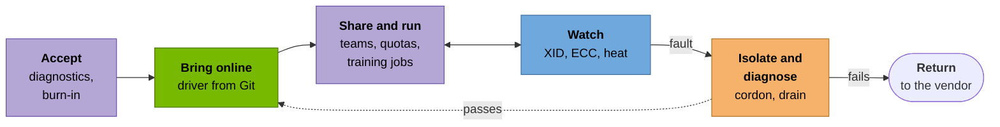
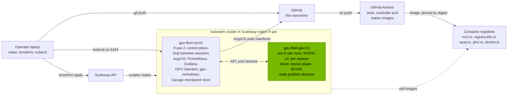

<h1 align="center">NVIDIA GPU Fleet PoC: Day 2 operations on upstream Kubernetes</h1>

<p align="center">
  <b>Bring GPUs online · watch them · pull the broken ones · measure what failures cost</b><br/>on a rented NVIDIA L4, run from Git<br/>
  kubeadm · ArgoCD app-of-apps · GPU Operator · DCGM · Prometheus
</p>

<p align="center">
  <a href="https://yassineteimi.github.io/nvidia-gpu-fleet-poc/"><b>Read the full build and runbook</b></a>
</p>

---

Training a large model keeps thousands of GPUs busy on one job, and when one of them
fails the job stops. Meta's [Llama 3 paper](https://arxiv.org/abs/2407.21783) counted
419 unexpected interruptions in 54 days on 16,384 H100s, most of them hardware. Running
those GPUs well (bringing them online, watching them, pulling the broken ones and
measuring what failures cost) is the job behind every GPU cloud.

I rebuilt that job on a small scale. One NVIDIA L4, rented by the hour on Scaleway,
joined to a Kubernetes cluster I built with kubeadm and run entirely from this
repository through ArgoCD: nobody installs anything on the GPU node by hand, and a
driver upgrade is a commit.

## Six use cases, one GPU



Green is Session A, blue Session B, orange Session C, purple Session D. Each one is
[explained for non-specialists here](https://yassineteimi.github.io/nvidia-gpu-fleet-poc/use-cases/).

| Use case | What happened on the L4 | Session |
| --- | --- | --- |
| Bring GPUs online the same way every time | The GPU Operator installed driver `595.91.07`, pinned in Git, on a node that booted with no driver | [A](https://yassineteimi.github.io/nvidia-gpu-fleet-poc/01-platform/) |
| See a failing GPU before the customer does | A simulated XID 79 reached Alertmanager as a critical alert in 32 s; a real power-throttling alert fired under load | [B](https://yassineteimi.github.io/nvidia-gpu-fleet-poc/02-observability/) |
| Take a broken GPU out of service on its own | An injected XID 79 cordoned the node in 0.12 s and drained it in 2.5 s; it only came back after `dcgmi diag` passed | [C](https://yassineteimi.github.io/nvidia-gpu-fleet-poc/03-fault-remediation/) |
| Share one GPU between teams, fairly | One commit turned the L4 into 4 slices in 88 s; a team's quota refused its third pod | [D](https://yassineteimi.github.io/nvidia-gpu-fleet-poc/04-goodput-and-burn-in/) |
| Know how much of a training run was useful | A PyTorch job lost its GPU, resumed from a checkpoint and finished at 66.4% goodput | [D](https://yassineteimi.github.io/nvidia-gpu-fleet-poc/04-goodput-and-burn-in/) |
| Accept new hardware before it takes real work | 3 hours at full load: 65 °C flat, no throttling, no errors, diagnostics passed before and after | [D](https://yassineteimi.github.io/nvidia-gpu-fleet-poc/04-goodput-and-burn-in/) |

All four sessions ran on real L4s between 24 September and 3 October 2026. The GPU
faults were injected, since a rented GPU doesn't fail on demand, and
[this page](https://yassineteimi.github.io/nvidia-gpu-fleet-poc/simulated/) lists
everything that was simulated. The cluster is switched off now; every result links to
output committed during a session, and `make cluster && make argocd && make up`
rebuilds it.

## Architecture



Every component, the network and the order ArgoCD deploys things in are on the
[architecture page](https://yassineteimi.github.io/nvidia-gpu-fleet-poc/architecture/).

## Repository layout

```text
nvidia-gpu-fleet-poc/
├── docs/          # the published GitHub Pages site (MkDocs Material)
├── terraform/     # both nodes, cloud-init, private network
├── gitops/        # ArgoCD app-of-apps: Applications, Helm values, manifests
├── controllers/   # gpu-remediator, Python on the Kubernetes client (Session C)
├── workloads/     # CUDA acceptance pods; PyTorch training job and goodput analysis in Session D
└── scripts/       # gpu-up, gpu-down, acceptance, and each session's drivers and capture
```

## Quick start

> The verified prerequisites are in the
> [tutorial](https://yassineteimi.github.io/nvidia-gpu-fleet-poc/prerequisites/). In short:

```bash
cp .env.example .env    # add your Scaleway API keys (gitignored)
make cluster            # private network and the persistent control plane node, once
make argocd             # install ArgoCD and hand it this repository, once
make up                 # provision the GPU node, join it, wait for the GPU to be schedulable
make down               # drain, remove and destroy the GPU node
make cost               # how long the GPU has been up and what it has cost
```

## Cost

The L4 costs 0.79 euros an hour and only existed during a session. The small control
plane, about 4 cents an hour, stayed up between sessions so Prometheus kept its
history, and I destroyed it after Session D.

## Secrets

Credentials live in a gitignored `.env` and never reach Git, logs or the published site.
The node join token is created on demand by the control plane and expires; it isn't
stored anywhere.

## Stack


## Contact

[](https://linkedin.com/in/yassine-teimi)
[](mailto:yteimi@gmail.com)

---
<p align="center"><sub>Independent work, not affiliated with or endorsed by any vendor named here.</sub></p>
