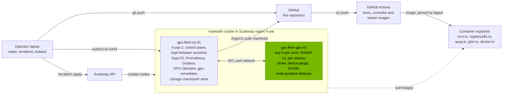

<h1 align="center">NVIDIA GPU Fleet PoC: Day 2 operations on upstream Kubernetes</h1>

<p align="center">
  <b>Driver lifecycle · GPU health telemetry · Fault remediation · Goodput</b> on a rented NVIDIA L4, run from Git<br/>
  kubeadm · ArgoCD app-of-apps · GPU Operator · DCGM · Prometheus
</p>

<p align="center">
  <a href="https://yassineteimi.github.io/nvidia-gpu-fleet-poc/"><b>Read the full build and runbook</b></a>
</p>

---

I rent an NVIDIA L4 on Scaleway by the hour, join it to a kubeadm cluster, and run it
the way a fleet operator would: every component comes from this repository through
ArgoCD, and nobody touches the node by hand. The NVIDIA driver and container toolkit
are pinned in a values file, so upgrading the driver is a commit. When a session ends I
destroy the GPU node, and the next session rebuilds it from Git.

It's one GPU and a small control plane, so it's a fleet method at small scale, not a
fleet. I've kept a page listing
[everything that's simulated](https://yassineteimi.github.io/nvidia-gpu-fleet-poc/simulated/).
The main item: the GPU never actually failed. In Session B I injected an XID into DCGM
to test alerting, and in Session C I wrote them into the node's kernel log to test
detection and remediation.

> **The cluster is switched off.** I destroyed both nodes and the network on 2026-10-03,
> after Session D, so nothing is billing. Every result on these pages comes from output
> committed to `docs/artifacts/`, not from a live system. `make cluster && make argocd`
> rebuilds the control plane from this repository in about 30 minutes, and `make up`
> adds the GPU node.

## Architecture



Every component on both nodes, the network, and the order ArgoCD deploys things in are
on the [architecture page](https://yassineteimi.github.io/nvidia-gpu-fleet-poc/architecture/).

## Build status

| Session | Scope | Status |
| --- | --- | --- |
| A | Terraform nodes, kubeadm, ArgoCD, NFD, GPU Operator, CUDA acceptance | **Done.** Acceptance passed on a real L4, 2026-09-24 |
| B | DCGM telemetry, Grafana dashboard, XID and utilisation alerting | **Done.** All five criteria met on a real L4, one with a caveat I explain in the write-up, 2026-09-24 |
| C | node-problem-detector, remediation controller, fault injection | **Done.** XID 79 cordoned the L4 node in 0.12 s and drained it in 2.5 s; five of six criteria passed outright, 2026-09-28 |
| D | Time slicing and tenancy, goodput, burn-in, acceptance runbook | **Done.** 4 time-sliced GPUs from one commit, quotas enforced, 66.4% goodput through an injected XID 79, and a 3 hour burn-in at 65 °C with no throttling or errors, 2026-10-03 |

## What it covers

| Capability | What it does | Session |
| --- | --- | --- |
| **Driver and toolkit lifecycle** | NVIDIA GPU Operator with Node Feature Discovery. Versions pinned in Git; a driver upgrade is a commit that ArgoCD rolls out | A |
| **GPU health telemetry** | DCGM exporter with a custom counter set (utilisation, SM and tensor activity, framebuffer, temperature, power, ECC, row remapping, clock event reasons, XID) and Prometheus alert rules, each with a unit test | B |
| **Fault detection and remediation** | node-problem-detector reads `NVRM: Xid` from the kernel log into a node condition. A Python controller cordons, records an event, annotates and drains. A node only returns to service after `dcgmi diag` passes | C |
| **Tenancy and goodput** | Time slicing from a commit, two tenant namespaces with GPU quotas, and a PyTorch job that checkpoints to Garage, loses its GPU to an injected XID 79 and resumes, with every second of the run accounted for | D |
| **Acceptance** | A 3 hour burn-in with criteria fixed before it ran, `dcgmi diag -r 3` before and after, and a 13 check acceptance runbook backed by this cluster's output | D |

## Repository layout

```text
nvidia-gpu-fleet-poc/
├── docs/          # the published GitHub Pages site (MkDocs Material)
├── terraform/     # both nodes, cloud-init, private network
├── gitops/        # ArgoCD app-of-apps: Applications, Helm values, manifests
├── controllers/   # gpu-remediator, Python on the Kubernetes client (Session C)
├── workloads/     # CUDA acceptance pods; PyTorch training job and goodput analysis in Session D
└── scripts/       # gpu-up, gpu-down, acceptance, and each session's drivers and capture
```

## Quick start

> The verified prerequisites are in the
> [tutorial](https://yassineteimi.github.io/nvidia-gpu-fleet-poc/prerequisites/). In short:

```bash
cp .env.example .env    # add your Scaleway API keys (gitignored)
make cluster            # private network and the persistent control plane node, once
make argocd             # install ArgoCD and hand it this repository, once
make up                 # provision the GPU node, join it, wait for the GPU to be schedulable
make down               # drain, remove and destroy the GPU node
make cost               # how long the GPU has been up and what it has cost
```

## Cost

The GPU node only existed during a session. The control plane stayed up between
sessions, which is what kept Prometheus history from one to the next, and I destroyed
it once Session D was written up.

| Item | Rate |
| --- | --- |
| Scaleway L4-1-24G, 1x L4 24 GB | EUR 0.79/h, up only during a session |
| Control plane, 4 vCPU / 8 GB | about EUR 0.04/h |

## Secrets

Credentials live in a gitignored `.env` and never reach Git, logs or the published site.
The node join token is created on demand by the control plane and expires; it isn't
stored anywhere.

## Stack


## Contact

[](https://linkedin.com/in/yassine-teimi)
[](mailto:yteimi@gmail.com)

---
<p align="center"><sub>Independent work, not affiliated with or endorsed by any vendor named here.</sub></p>
