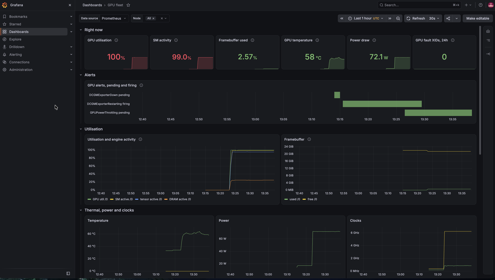
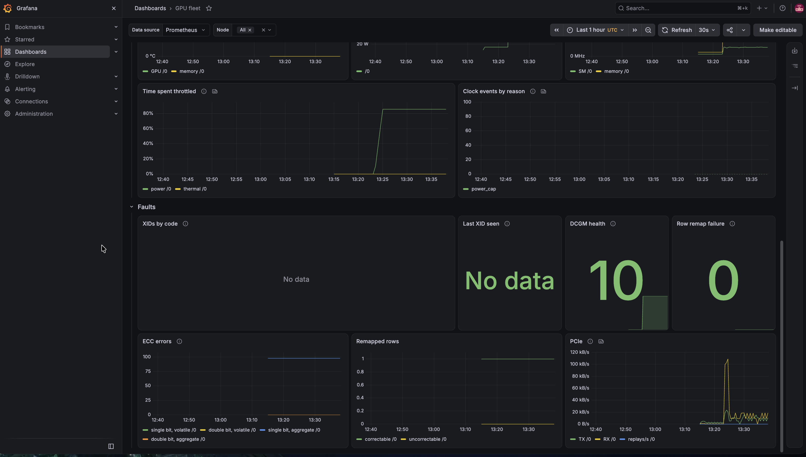
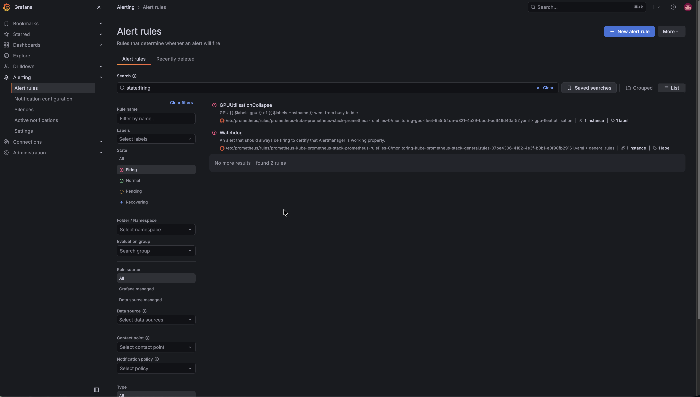
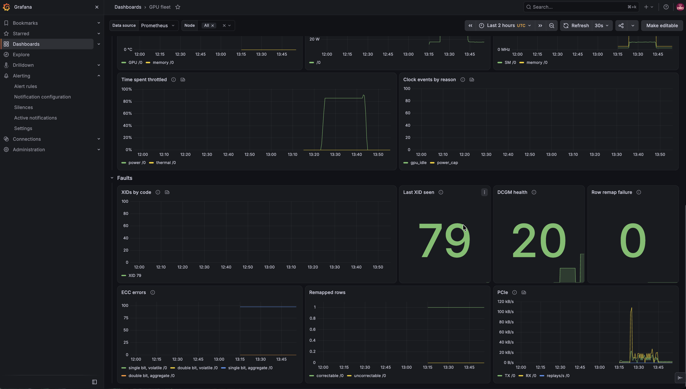

# Session B: observability and XID alerting

!!! success "Done, 2026-09-24"
    All five acceptance criteria passed on a real L4. One passed with a caveat: the
    load job had already finished when I killed it, and I explain that
    [below](#the-load-job-i-didnt-actually-kill). I also ran the XID alert end to end with an
    injected XID 79, which I mark as simulated wherever it appears.

**Scope:** Prometheus scrapes the DCGM exporter. A Grafana dashboard from Git shows
utilisation, framebuffer, temperature, power, ECC, clock event reasons and XID.
Alert rules cover critical XIDs and a job's utilisation collapsing.

## Results

| # | Acceptance criterion | Result | Evidence |
|---|---|---|---|
| 1 | Prometheus scrapes the exporter, and every counter in the custom set is there, including the ones the exporter ships disabled | **Pass.** 34 of 34 | [`session-b-counters.txt`](https://github.com/yassineteimi/nvidia-gpu-fleet-poc/blob/main/docs/artifacts/session-b-counters.txt) |
| 2 | A dashboard loaded from Git, not built in the UI, shows live data | **Pass.** Every panel with data to show had it. Two panels had a bug, which I found and fixed ([details](#the-dashboard-had-the-same-bug-as-the-alert)) | Screenshots below |
| 3 | `GPUUtilisationCollapse` goes pending, then firing, after a real load job is killed | **Pass, with a caveat.** Pending 13:46:03, firing 13:47:03. The job had finished seconds before the kill | [`session-b-alert-timeline.txt`](https://github.com/yassineteimi/nvidia-gpu-fleet-poc/blob/main/docs/artifacts/session-b-alert-timeline.txt), [`session-b-load-timeline.txt`](https://github.com/yassineteimi/nvidia-gpu-fleet-poc/blob/main/docs/artifacts/session-b-load-timeline.txt) |
| 4 | Every alert rule has a `promtool` unit test that passes offline | **Pass.** 12 test cases, 26 alert evaluations. I added one during the session | `make test-rules`, and the `test-rules` job in CI |
| 5 | Prometheus history survives destroying the GPU node | **Pass.** 193 GPU utilisation samples, peak 100%, read back with no GPU node in the cluster | [`session-b-history.txt`](https://github.com/yassineteimi/nvidia-gpu-fleet-poc/blob/main/docs/artifacts/session-b-history.txt) |
| opt. | `GPUXidCritical` fires on an XID 79 injected through DCGM | **Fired. Simulated.** 32 seconds from injection to Alertmanager | [`session-b-alertmanager.txt`](https://github.com/yassineteimi/nvidia-gpu-fleet-poc/blob/main/docs/artifacts/session-b-alertmanager.txt) |

## Timeline

All times are UTC, taken from the files in `docs/artifacts/`. Prometheus's `ALERTS`
series was read back at a 15 second step, so the alert times are accurate to 15
seconds. The Alertmanager times are exact.

| Time | Event |
|---|---|
| 13:13:48 | `DCGMExporterDown` pending: the target exists but doesn't answer yet. It cleared at 13:14:33 without firing, which is what its 5 minute `for:` is there for |
| 13:14:18 | The exporter's second and last crash. It couldn't reach the standalone DCGM host engine |
| 13:15:18 | `DCGMExporterRestarting` fires on those two restarts. It shouldn't have ([why](#two-restarts-and-an-alert-that-miscounted-them)) |
| 13:23:14 | Load running: `dcgmproftester13` keeps the tensor cores busy, 20 minutes requested |
| 13:26:18 | `GPUPowerThrottling` pending. I hadn't planned for this one |
| 13:41:18 | `GPUPowerThrottling` fires after 15 minutes pending |
| ~13:43 | The load reaches the end of its 20 minutes and exits |
| 13:43:09 | `make load-stop` |
| 13:46:03 | `GPUUtilisationCollapse` pending |
| 13:47:03 | `GPUUtilisationCollapse` firing. Alertmanager has it from 13:47:00 |
| 13:49:58 | XID 79 injected into DCGM's cache. **Simulated** |
| 13:50:30 | `GPUXidCritical` reaches Alertmanager, severity critical, `xid="79"` |
| 14:03:57 | After `make down`: no GPU node left, and its history is still in Prometheus |

## The L4 under load



Utilisation 100%, SM activity 99%, tensor pipes about 95% active and DRAM about 25%.
That's the profile a tensor core benchmark should have, compute bound rather than
memory bound, and `dcgmproftester` reported about 49.4 TFLOPS
([`session-b-load-job.txt`](https://github.com/yassineteimi/nvidia-gpu-fleet-poc/blob/main/docs/artifacts/session-b-load-job.txt)).
Framebuffer use stayed at 2.57%, since the test runs out of registers and shared
memory. The card drew 72.1 W at 58 °C.



72 W is the L4's power limit. The card spent about 85% of the load throttled for
power, none of it for temperature, and the SM clock sat well below what an
unconstrained L4 runs at. The card is fine; a 72 W part under a sustained tensor load
is power bound, and DCGM shows exactly that.

So **`GPUPowerThrottling` fired on real hardware behaviour**, without anything
injected. The rule fires when power throttling takes more than half the time for 15
minutes, and 20 minutes of tensor load was enough. I made it `info` on purpose. An L4
at full load is expected to be power bound, so the alert only matters on a job that
shouldn't be anywhere near the limit, and nobody should be woken up for it. It
resolved by itself once the load stopped.

## The load job I didn't actually kill



`GPUUtilisationCollapse` compares the 10 minutes that ended 3 minutes ago with the
last 3 minutes. It went pending 2 minutes 54 seconds after `make load-stop`, as that
3 minute window closed, and fired a minute later on its `for:`. The rule in the
screenshot is the one ArgoCD loaded from `gitops/manifests/observability/`.

The criterion said the job had to be **killed**, and strictly speaking it wasn't. I
requested 20 minutes of load. When `make load-stop` read the job's log at 13:43:09,
it already ended with `GPU 0, TestField 1004 test PASSED.` and `All Tests Passed.`, so
`dcgmproftester` had finished a few seconds earlier and the stop deleted a completed
job. The alert can't tell the difference, since what it detects is a busy GPU going
idle with no warning, and that did happen. Still, "killed" was the claim, so I'm
recording it as not quite met.

I changed two things so it can't happen again: `make load` now defaults to an hour,
and `make load-stop` records whether the pod was still running when it deleted it,
with a warning if it wasn't.

## A simulated XID, from DCGM to Alertmanager

`make inject-xid-dcgm` uses `dcgmi test --inject` to write the value 79 into DCGM's
field 230, `DCGM_FI_DEV_XID_ERRORS`. Nothing happened on the card. What this tests is
everything downstream of DCGM:

- the exporter turns the value into the raw field and into its own counter,
  `DCGM_EXP_XID_ERRORS_TOTAL{xid="79"}`;
- the rule's "new series" branch catches a first XID, which a plain `increase()`
  would miss ([Findings](findings.md) has the details);
- Alertmanager receives it as critical, 32 seconds after the injection.

It also answered a question from my first capture, which had reported
`DCGM_FI_DEV_XID_ERRORS` as missing. Before the injection the field had no series,
and afterwards it had one: a GPU that's never had an XID gives the exporter nothing
to publish.



After the injection, "Last XID seen" reads 79 and DCGM health reads 20, DCGM's FAIL
result. During the load it had read 10, a warning. I didn't capture which DCGM health
system raised that warning, so I won't guess.

## The dashboard had the same bug as the alert

Look at that last screenshot again. The alert fired and "Last XID seen" says 79, but
"XIDs by code" is flat at zero. The panel plotted
`increase(DCGM_EXP_XID_ERRORS_TOTAL[$__rate_interval])`, and a series that starts at 1
and stays there has no increase. I'd written and unit tested the alert rule
specifically to avoid this trap, then walked into it on the dashboard, which had no
tests. "Clock events by reason" had the same problem: the power cap switched on once,
stayed on for 20 minutes, and the panel showed nothing.

Both panels now plot the cumulative count since the exporter started.

## Two restarts, and an alert that miscounted them

Session A left a question open: `nvidia-dcgm-exporter` restarted three times while the
node came up, and I hadn't captured why. This time it restarted twice, and
`make capture-b` saved the previous container's log
([`session-b-exporter-restarts.txt`](https://github.com/yassineteimi/nvidia-gpu-fleet-poc/blob/main/docs/artifacts/session-b-exporter-restarts.txt)):

```{ .sh .terminal }
level=INFO msg="Attempting to connect to remote hostengine at nvidia-dcgm:5555"
level=ERROR msg="Failed to connect to remote hostengine" mode=standalone address=nvidia-dcgm:5555
  error="error connecting to nv-hostengine: Host engine connection invalid/disconnected"
```

The exporter starts before the standalone DCGM host engine accepts connections, exits
with code 1, and the kubelet restarts it until the host engine answers. That's the
price of running DCGM standalone, which I keep because Session C needs `dcgmi diag`.
It's harmless; the restarts are how it recovers, and the exporter stayed up for the
rest of the session.

The alert I'd written for this, `DCGMExporterRestarting`, is meant to fire on more
than two restarts in 15 minutes. It fired on two. `increase()` extrapolates on a
counter that starts inside its window, and for a few seconds it read about 2.3. I
reproduced it offline with `promtool`, switched the rule to `changes()`, and added a
regression test that fails on the old rule.

## What this GPU had been through before I rented it

Two panels show history the card came with: **one correctable remapped row**, and an
aggregate count of **just under 100 single-bit ECC errors**. Aggregate counters
survive reboots, so they cover the card's whole life, not this session. There are no
uncorrectable remapped rows, no remap failures and no double-bit errors, so it's a
healthy GPU but not a new one. An acceptance procedure should read these counters at
handover rather than assume they start at zero. I read these values off the
screenshots; I didn't capture them as text.

## What I changed because of the session

| Change | Reason |
|---|---|
| `DCGMExporterRestarting` uses `changes()` | It fired on two restarts |
| "XIDs by code" and "Clock events by reason" plot cumulative counts | Both stayed flat through a real XID series and a real power cap |
| `capture-b` expects no `DCGM_FI_DEV_XID_ERRORS` series before the first XID | My first capture reported a correct absence as missing |
| `make load` defaults to an hour; `make load-stop` records whether it killed anything | The stop deleted a job that had already finished |

---

## How I built it

The rest of this page is the preparation: the plan, the decisions, and the work done
before any GPU was rented.

### The plan

Three parts, and only the middle one rents a GPU.

| Part | What | GPU cost |
|---|---|---|
| B1, authoring | Storage, kube-prometheus-stack, custom counters, alert rules and their unit tests, dashboard, and the scripts that drive B2. Deployed to the control plane only | none |
| B2, live | GPU up, targets checked, real load, job killed, alert watched firing, evidence captured, GPU down | about an hour |
| B3, write-up | This page from the artifacts, then updating the landing page so nothing claims Sessions C or D are done | none |

### Decisions

| Decision | Choice | Why |
|---|---|---|
| Metrics storage | local-path provisioner on the control plane disk | History survives pod restarts and every GPU node teardown, with no cloud credentials in the cluster. I'd lose it only if I rebuilt the control plane |
| Where monitoring runs | Pinned to the control plane by node selector | Otherwise a volume could land on the GPU node and be destroyed with it at the end of the session |
| Alert routing | Alertmanager with a null receiver | The acceptance test needs to see an alert fire, and the Alertmanager API records that. No webhook or SMTP credential to manage |
| Proving the XID rule | `promtool` unit tests, plus an optional DCGM injection | I can't make a real XID happen on demand. The unit tests prove the rule's logic; the injection proves the pipeline, and it's listed as simulated |
| Load for the collapse alert | `dcgmproftester` from the DCGM image | A real tensor workload, with no extra image to pull onto a node billed by the hour. I checked it was in the image before renting a GPU |

### What reading the source changed

Before writing anything I checked the plan against the exporter and the operator chart
at the versions this cluster runs. Three things changed.

**There's a proper XID counter, and it's off by default.** dcgm-exporter `4.8.3`, the
version GPU Operator `v26.7.0` deploys, has `DCGM_EXP_XID_ERRORS_TOTAL`: a counter with
one series per `xid` label, meant for `increase()` and `rate()`. That fixes the problem
in [Findings](findings.md), where `DCGM_FI_DEV_XID_ERRORS` only holds the last XID and
never resets, so you can't alert on it directly. The default counter set comments it
out, along with every ECC counter, the power and thermal violation counters,
`DCGM_FI_PROF_SM_ACTIVE` and the clock event counters. My custom counter set, kept in
Git, turns them all on.

It doesn't catch everything, because it's derived from the same DCGM field. An XID
that DCGM never reports, like XID 62, stays invisible. That's why Session C's fault
detection reads the kernel log and only uses DCGM to corroborate.

**Standalone DCGM was my choice, not the chart default.** Session A's values set
`dcgm.enabled: true` under a comment that made it sound like the default. The chart
default is `false`, with DCGM embedded in the exporter. I kept standalone because
Session C gates return to service on `dcgmi diag`, which needs a DCGM to run against,
but I fixed the comment. It also made standalone DCGM my main suspect for Session A's
exporter restarts, and the session proved that suspicion right.

**The monitoring CRDs have to exist before the GPU Operator.** The operator chart
creates a ServiceMonitor for the exporter by default, and that can't exist until the
Prometheus Operator's CRDs do. So kube-prometheus-stack moved to sync wave 0, next to
Node Feature Discovery, instead of wave 1.

### B1: writing it

I wrote and checked everything before any of it reached the cluster.

| Piece | Where | How I checked it first |
|---|---|---|
| Health checks for Application resources, so the sync waves actually wait | `gitops/bootstrap/argocd-values.yaml` | Copied from ArgoCD's documentation for v3.5.3 |
| Storage that refuses volumes on the GPU node | `gitops/apps/local-path-provisioner.yaml`, `gitops/values/local-path-provisioner.yaml` | Every key exists in the chart's values at v0.0.37 |
| kube-prometheus-stack, pinned to the control plane | `gitops/apps/kube-prometheus-stack.yaml`, `gitops/values/kube-prometheus-stack.yaml` | Every key exists in the chart's values at 91.4.1, and in the Grafana 13.2.5 and kube-state-metrics 8.5.0 subcharts it pins |
| 34 DCGM counters, kept in Git | `gitops/values/gpu-operator.yaml` | Field names copied from dcgm-exporter 4.6.0-4.8.3's own counter file; the ConfigMap wiring traced through the operator's chart template and controller |
| 9 alert rules | `gitops/manifests/observability/gpu-alerts.yaml` | `promtool` 3.14.0, the version the chart deploys: syntax, then 11 test cases and 25 alert evaluations at the time. I broke four rules on purpose, and each time the matching test failed |
| The dashboard, 21 panels | `gitops/manifests/observability/dashboards/gpu-fleet.json` | All 34 queries parse in `promtool`; every DCGM metric they use is in the counter set; `kustomize build` produces the ConfigMap with the sidecar's label |
| The B2 scripts | `scripts/check-dcgm-image.sh`, `load.sh`, `inject-xid-dcgm.sh`, `capture-b.sh`, `grafana-ui.sh` | `shellcheck`. Every `dcgmproftester` and `dcgmi test --inject` flag read from DCGM's source; field IDs 230 and 1004 from `dcgm_fields.h` |

Three things I couldn't check from where I wrote this. First, whether the charts render
with these values, since `helm` and the chart repositories weren't reachable; ArgoCD's
first sync answers that. Second, whether an injected value reaches the exporter's XID
counter. Third, whether `dcgmproftester` runs on an L4 next to a standalone DCGM. B2
answered the last two.

### B1: deploying it

I ran `make argocd` first, so ArgoCD would check the health of Application resources,
and only then pushed to `main`. Pushing first would have deployed the stack with the
creation-only ordering the health checks exist to prevent.

```{ .sh .terminal }
$ kubectl -n argocd get applications.argoproj.io
NAME                     SYNC STATUS   HEALTH STATUS
gpu-observability        Synced        Healthy
gpu-operator             Synced        Healthy
kube-prometheus-stack    Synced        Healthy
local-path-provisioner   Synced        Healthy
node-feature-discovery   Synced        Healthy
root                     Synced        Healthy
```

All four new or changed Applications synced on the first try, which settled whether
the charts render with these values.

```{ .sh .terminal }
$ kubectl -n monitoring get pods,pvc
NAME                                                            READY   STATUS    RESTARTS   AGE
pod/alertmanager-kube-prometheus-stack-alertmanager-0           2/2     Running   0          2m41s
pod/kube-prometheus-stack-grafana-74ccfb594b-lxdqs              3/3     Running   0          56s
pod/kube-prometheus-stack-kube-state-metrics-84f8496f5c-8kmbq   1/1     Running   0          2m49s
pod/kube-prometheus-stack-operator-5b5dcc8f66-pdbvl             1/1     Running   0          2m49s
pod/kube-prometheus-stack-prometheus-node-exporter-28d9r        1/1     Running   0          2m49s
pod/prometheus-kube-prometheus-stack-prometheus-0               2/2     Running   0          2m40s

NAME                                                                                                   STATUS   CAPACITY   STORAGECLASS
persistentvolumeclaim/prometheus-kube-prometheus-stack-prometheus-db-prometheus-kube-prometheus-stack-prometheus-0   Bound    25Gi       local-path
```

I cut the claim's `VOLUME`, `ACCESS MODES`, `VOLUMEATTRIBUTESCLASS` and `AGE` columns
for width. The 25 Gi volume bound through local-path is what lets GPU metrics outlive
the GPU node.

### Checking the DCGM image without a GPU

Before renting a GPU, I ran the DCGM image the GPU Operator uses,
`nvcr.io/nvidia/cloud-native/dcgm:4.6.0-1-ubuntu24.04`, on the control plane
([`session-b-dcgm-image-check.txt`](https://github.com/yassineteimi/nvidia-gpu-fleet-poc/blob/main/docs/artifacts/session-b-dcgm-image-check.txt)):

```{ .sh .terminal }
== dcgmproftester binaries
/usr/bin/dcgmproftester12
/usr/bin/dcgmproftester13
...
== dcgmi test --help (injection)
   dcgmi test --host <IP/FQDN> --inject --gpuid <gpuId> -f <fieldId> -v
      --inject                Inject values into cache.
```

`dcgmproftester` is there in CUDA 12 and CUDA 13 builds, and `dcgmi test` supports
`--inject`. So B2 could generate real load without pulling another image, and the
simulated XID was possible.

My first version of the check also reported `FAIL  --no-dcgm-validation not found in
its help`, which was wrong, and the bug was in my check, not the image. It printed
nothing at all for either binary, not even `-d` and `-t`, so `--help` had never run.
`dcgmproftester` links against `libcuda`, which only exists on a node with an NVIDIA
driver; my check piped the loader error through `grep` and read the empty result as
a missing flag. The script now shows the unfiltered output and the missing libraries,
and reports that case as inconclusive. On the GPU node, `make load` checks the job 20
seconds in, so a rejected flag would have cost 20 seconds rather than 10 minutes. The
flag worked.
