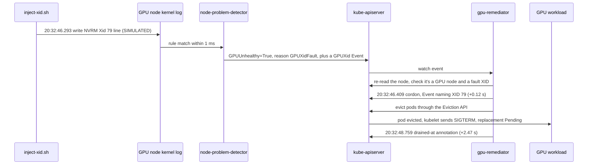
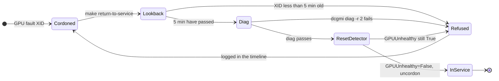

# Session C: fault detection and remediation

!!! abstract "The use case"
    At fleet scale nobody drains a node by hand at 3 a.m. When a GPU reports a fault,
    software should take the node out of service and move its work, and let it back in
    only once a diagnostic passes.

!!! success "Passed on a real L4, 2026-09-28"
    An injected XID 79 cordoned the node in 0.12 seconds and drained it in 2.5; an
    XID 13, an application error, left it alone. Five of six criteria passed outright.
    The sixth never saw a failing diagnostic, because a healthy GPU doesn't fail on
    request. Every XID here was injected.

Here's the first XID 79, with the times I measured: the injection from the GPU node's
clock, the rest from the controller's annotations.



## Results

| # | Acceptance criterion | Result | Evidence |
|---|---|---|---|
| 1 | XID 79 on the GPU node, with a workload running: `GPUUnhealthy=True`, cordoned, and an Event naming the XID, all within 60 seconds | **Pass.** Cordoned 0.12 s after the injection, with the Event "XID 79 (GPU has fallen off the bus) on PCI 0000:01:00". A second run took 0.87 s | [`session-c-xid79.txt`](https://github.com/yassineteimi/nvidia-gpu-fleet-poc/blob/main/docs/artifacts/session-c-xid79.txt) |
| 2 | The workload evicted, only DaemonSet pods left, and the drain time measured | **Pass.** Drained 2.47 s after the injection (3.19 s on the second run). What's left is DaemonSets plus the GPU Operator's completed CUDA validator | Same file |
| 3 | XID 13, an application error: an Event and no cordon | **Pass.** One `GPUXid` Event; the node stayed schedulable and the workload kept running | [`session-c-xid13.txt`](https://github.com/yassineteimi/nvidia-gpu-fleet-poc/blob/main/docs/artifacts/session-c-xid13.txt) |
| 4 | The same injection on the control plane: the condition is set and the controller refuses to touch a node that isn't a GPU node | **Pass.** One `RemediationRefused` Event, no cordon | [`session-c-cp-refused.txt`](https://github.com/yassineteimi/nvidia-gpu-fleet-poc/blob/main/docs/artifacts/session-c-cp-refused.txt) |
| 5 | Return to service refuses while the condition is fresh or `dcgmi diag` fails, and on success the workload lands back on the node | **Pass on two paths out of three.** `dcgmi diag -r 2` passed in 6 seconds, the node was uncordoned and the pending workload was scheduled back onto it. Run inside the 5-minute lookback, it refused and left the node cordoned. The diag-failure path never ran | [`session-c-returned.txt`](https://github.com/yassineteimi/nvidia-gpu-fleet-poc/blob/main/docs/artifacts/session-c-returned.txt), [`session-c-refused-early.txt`](https://github.com/yassineteimi/nvidia-gpu-fleet-poc/blob/main/docs/artifacts/session-c-refused-early.txt), [`session-c-dcgmi-diag.txt`](https://github.com/yassineteimi/nvidia-gpu-fleet-poc/blob/main/docs/artifacts/session-c-dcgmi-diag.txt) |
| 6 | Controller unit tests run offline in CI | **Pass.** 40 tests at deploy time, 42 after a bug found during the session. The detector rule has its own tests, run through node-problem-detector's code | `make test-controller`, `make test-npd-rules`, both in CI |

??? note "Timeline, to the millisecond"

    All times are UTC, from [`session-c-timeline.txt`](https://github.com/yassineteimi/nvidia-gpu-fleet-poc/blob/main/docs/artifacts/session-c-timeline.txt)
    and the captures. The injection time comes from the GPU node's own clock, taken in
    the same SSH command that writes the line. The cordon and drain times come from the
    controller, running on the control plane, so each gap spans two machines' clocks, and
    I'd treat the sub-second figures as good to a few hundred milliseconds.

    | Time | Event |
    |---|---|
    | 19:54:04 | Control plane: XID 79 injected. Condition set, `RemediationRefused` 0.37 s after node-problem-detector reported it |
    | 20:05:32 | Control plane: condition cleared by `make return-to-service`, 11 minutes later |
    | 20:19:06 | node-problem-detector starts on the new GPU node |
    | 20:23:05.355 | GPU node: **XID 13** injected. A `GPUXid` Event, nothing else |
    | 20:32:46.293 | GPU node: **XID 79** injected. node-problem-detector logs the new status at 20:32:46.293 on the same clock |
    | 20:32:46.409 | Cordoned, `GPUFaultCordoned` Event with the decoded XID |
    | 20:32:48.759 | Drained. The workload's replacement pod sits `Pending`, with nowhere to go |
    | 20:40:25 to 20:40:31 | `dcgmi diag -r 2`: software, memory and PCIe all Pass |
    | 20:40:43 | Uncordoned. The pending pod was scheduled back onto the node |
    | 20:49:26.839 | **XID 79** again, to see the early refusal. Cordoned at 20:49:27.704, drained at 20:49:30.028 |
    | 20:49:44 | Return to service, run inside the lookback, refused: the node was still cordoned in the capture right after it |

## The way back into service

Nothing uncordons a node on its own. `make return-to-service` runs these gates in
order and stops at the first one that fails, leaving the node cordoned.



The session ran the success path, where the diag passed in 6 seconds and the workload
went back onto the node, and the lookback refusal. It never ran the diag-failure
refusal, because the L4 was healthy. The reset step restarts node-problem-detector on
the node, which is the only way its condition goes back to False; the section on
reading node-problem-detector, further down, explains why.

## What the XID 13 then XID 79 order was for

I injected the application error first on purpose. My first design sent every XID to
one condition and let the controller classify the code, and reading
node-problem-detector showed why that fails: once a condition is True, its message
stops changing. So an XID 13 followed by an XID 79 would have left the node
reporting 13, and the broken GPU would never have been drained. The rule now makes
the fault or application call itself, and on the L4 the 79 that followed the 13
cordoned the node exactly as the rule's test says it should.

## What the injection doesn't prove

The device plugin kept advertising `nvidia.com/gpu: 1` throughout. That's expected:
it learns about XIDs through NVML, not the kernel log, so my injected line never
reached it. On a real XID 79 the driver, NVML and the device plugin would all react
as well, and the GPU would drop out of the node's allocatable resources on top of the
cordon. The injection tests the kernel log path, from node-problem-detector to the
controller to the drain, and that's all I claim for it.

The drain took 2.5 seconds partly because my workload handles SIGTERM and exits at
once. A training job that needs its full 30 second grace period to write a checkpoint
would drain in about 30 seconds, and a PodDisruptionBudget could hold it longer.
The controller retries a blocked eviction rather than deleting the pod, and a unit
test covers that, but it didn't happen on the cluster.

## One bug, found live

The first XID 79 produced three `GPUNodeDrained` Events for one drain. The node
watch events that queued up while the controller was draining carried a copy of the
node from before its own `drained-at` annotation, so each of them looked like a node
that still needed draining; the controller found no pods and announced it again. It
did no harm, but a controller that reports the same drain three times makes its
event trail harder to trust. The controller now reads the node again before acting on
anything that looks unhealthy, and two regression tests replay the stale copy. Both
fail without the fix. The session ran the old version, which is why the second
injection at 20:49 shows three drain Events as well.

??? note "Two more things the clocks showed"

    **The condition's timestamp runs early.** `GPUUnhealthy`'s `lastTransitionTime` comes
    from the kernel log record, which node-problem-detector dates from the kernel's uptime
    counter. On the control plane, six days after boot, it read about 4 seconds earlier
    than the moment node-problem-detector actually processed the line; on the freshly
    booted GPU node, about 1 second. So I timed everything from the node's wall clock and
    the controller's own annotations instead.

    **A level 2 diagnostic took 6 seconds, not minutes.** I'd picked level 2 over level 3
    to save GPU time. On an L4 against the standalone host engine, level 2 ran its
    software, memory and PCIe checks in 6 seconds, which makes level 3 look affordable for
    return to service. I haven't timed level 3, so it stays at 2 for now, and the level is
    a setting.

## How I built it

??? note "What I changed because of the session"

    | Change | Reason |
    |---|---|
    | The controller reads the node again before acting | Three `GPUNodeDrained` Events for one drain |
    | `inject-xid.sh` takes the injection time from the node's clock | The condition's timestamp ran up to 4 seconds early |
    | `return-to-service.sh` records every refusal in the timeline | The early refusal only reached the terminal, so its text isn't in the evidence |
    | `return-to-service.sh` does nothing on a node that's already in service | A second run on a healthy node ran the diagnostic and restarted node-problem-detector for no reason |

    ---

??? note "The plan, the decisions and how I checked them"

    **The plan**

    | Part | What | GPU cost |
    |---|---|---|
    | C1, authoring | node-problem-detector with the GPU monitor, the controller and its tests, the CI image build, and the scripts. Deployed to the control plane, and criterion 4 tested there for free | none |
    | C2, live | GPU up, workload running, XID 13 then XID 79, timings, return to service, GPU down | under an hour |
    | C3, write-up | This page from the artifacts | none |

    **Decisions**

    | Decision | Choice | Why |
    |---|---|---|
    | Which XIDs cordon | Any XID except 13, 31, 43, 45, 68 and 109 | The device plugin's list in `internal/rm/health.go` at v0.20.0, which the Session B alerts use too. Prometheus, the scheduler and the controller shouldn't disagree about whether a GPU is broken |
    | Where that decision lives | In the node-problem-detector rule, with the controller checking it again | See the XID 13 then 79 section above. Go's regex engine has no lookahead, so the rule spells out "any number except these six", and a test checks every code from 0 to 2000 |
    | Controller packaging | Image built by GitHub Actions for `linux/amd64`, pushed to ghcr.io, pinned by digest in Git | No local build step, and no Apple Silicon `exec format error` trap |
    | Diag level for return to service | `dcgmi diag -r 2`, configurable | Picked to save GPU time. It turned out to take 6 seconds, and a real fleet would use level 3 or 4 |
    | node-problem-detector deployment | The upstream kustomization at tag `v1.36.0`, with the image overridden | There's no upstream Helm chart, and the manifest at that tag still references image `v0.8.19` |
    | Controller permissions | Read and patch nodes, list pods, evict pods, create Events | No pod delete, so it can't go around a disruption budget, and no write to `nodes/status`, so it can't clear the condition that tells it a GPU is broken |

    **What reading node-problem-detector changed**

    **Clearing the condition needs a restart, and the restart needs a wait.** I read the
    kernel log watcher and condition manager at `v1.36.0` before designing return to
    service. A "permanent" condition lasts as long as the process, and the condition
    manager re-sends its own view of every condition at least every 5 minutes
    (`--k8s-exporter-heartbeat-period`), so patching the node's condition back to False by
    hand wouldn't last. On startup the conditions reset, but the kernel log watcher
    replays every line newer than the monitor's `lookback`, which is 5 minutes.

    So return to service refuses until the lookback has passed since the XID, runs
    `dcgmi diag`, restarts node-problem-detector on that node, checks the condition is
    False, and only then uncordons. I kept the 5 minute lookback, because it's also what
    stops a real XID from being lost if node-problem-detector restarts. On the GPU node,
    restarting it 8 minutes after the XID cleared the condition without a replay, as
    expected.

    **One condition can't carry every XID**, for the reason in the XID 13 then 79 section.

    **Kernel log lines get trimmed.** node-problem-detector passes each line through
    `strings.TrimSpace`. When the driver has no message to add, its line ends in `79, `,
    which arrives as `79,`, so the rule ends in `,.*` rather than `, .*`, and a test covers
    the bare line.

    **C1: what I wrote, and how I checked it before the GPU session**

    | Piece | Where | How I checked it |
    |---|---|---|
    | The Xid line format | Read from `src/nvidia/src/kernel/gpu/rc/kernel_rc.c` at driver tag `595.91.07` | Three shapes: with a process, without one, and with MIG attribution inside the parenthesis. The tests use all three |
    | GPU monitor for node-problem-detector | `gitops/manifests/node-problem-detector/gpu-monitor.json` | Run through node-problem-detector's own `systemlogmonitor` package at `v1.36.0` (`make test-npd-rules`): every XID from 0 to 2000 classified like the device plugin, all three line shapes matched, other kernel lines ignored, a fault after an application error still caught. I broke the rule four ways and each break failed a test |
    | node-problem-detector deployment | `gitops/manifests/node-problem-detector/`, `gitops/apps/node-problem-detector.yaml`, wave 3 | `kustomize build`. I couldn't reach registry.k8s.io to check the `v1.36.0` image; the first sync showed it exists |
    | `gpu-remediator` | `controllers/gpu-remediator/` | `pytest` against a fake cluster: cordon before any eviction; DaemonSet, mirror and finished pods left alone; disruption budgets retried, never forced; non-GPU nodes refused; application XIDs never drained. I broke three guards and each break failed a test |
    | Controller image | `.github/workflows/remediator-image.yml` | Built by CI once the tests pass, pinned by the digest it prints. There was no Docker daemon where I wrote the code, so CI did the first build |
    | Scripts | `inject-xid.sh`, `return-to-service.sh`, `gpu-workload.sh`, `capture-c.sh` | `shellcheck`. The injected line has the driver's exact shape, and its message says SIMULATED, so the node's own kernel log says where it came from |

    **The free test on the control plane**

    Before renting the GPU, I wrote the same XID 79 line into the control plane's kernel
    log. node-problem-detector set `GPUUnhealthy=True`, and the controller refused 0.37
    seconds after node-problem-detector reported it, with one Event, no annotation other
    than its own `refused-at`, and no cordon:

    ```{ .sh .terminal }
    LAST                   TYPE      REASON               SOURCE            MESSAGE
    2026-09-28T19:54:04Z   Warning   GPUXid               gpu-xid-monitor   NVRM: Xid (PCI:0000:01:00): 79, pid=0, name=inject-xid.sh, SIMULATED by scripts/inject-xid.sh, not a real fault
    2026-09-28T19:54:04Z   Warning   GPUXidFault          gpu-xid-monitor   Node condition GPUUnhealthy is now: True, reason: GPUXidFault, ...
    2026-09-28T19:54:04Z   Warning   RemediationRefused   gpu-remediator    GPUUnhealthy is set but gpu-fleet-cp-01 has no feature.node.kubernetes.io/pci-10de.present=true label. Not cordoning a node that isn't a GPU node.
    ```

    That run also answered two open questions for nothing: the `v1.36.0` image exists,
    and the rule matches a line that really went through the kernel's log buffer, not
    just a string in a test.
