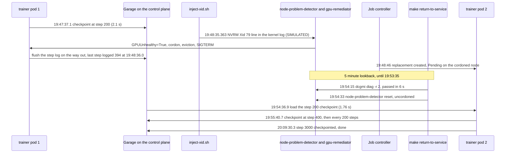
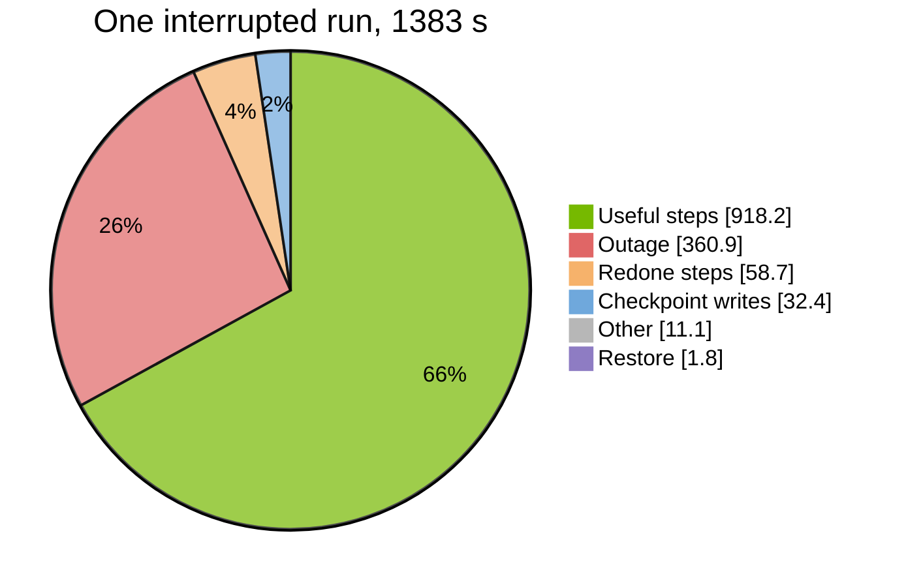
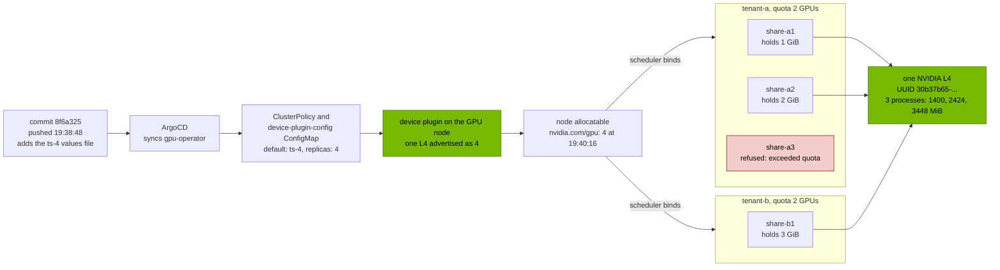
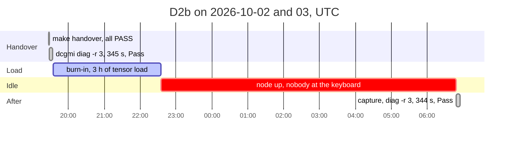
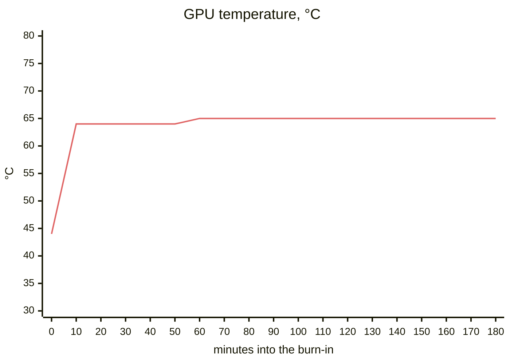
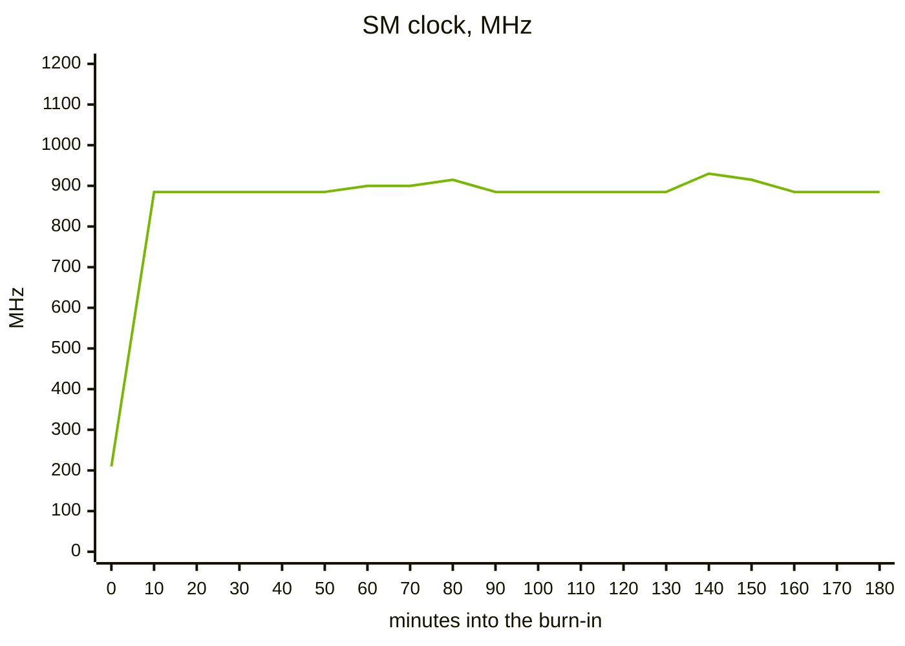

# Session D: goodput, burn-in and tenancy

!!! success "Done, 2026-10-03"
    One commit took the L4 from 1 schedulable GPU to 4 in 88 seconds, three pods from
    two tenants shared it, and the quota refused a third pod in the same tenant. A
    training job lost its pod to an injected XID 79, waited out the gated return to
    service, resumed from its step 200 checkpoint in Garage and finished at **66.4%
    goodput**. Then a second L4 ran 3 hours of tensor load at 65 °C flat, with no
    thermal throttling, no new errors and not one minute of missing telemetry, and
    passed `dcgmi diag -r 3` before and after. All six criteria pass, with two
    caveats on the burn-in that I spell out below. The XID was injected; no GPU failed.

**Scope:** time slicing the L4 through the GPU Operator, with two tenant namespaces
under ResourceQuota. A PyTorch training job that checkpoints to object storage, gets
interrupted by an injected XID 79 and resumes, with the time it lost measured. A 3 hour
burn-in with a stability record, and the acceptance runbook, filled in with commands
that ran on this cluster.

Here's the interrupted run. Times are UTC: the injection from the GPU node's clock,
the training events from the trainer's step log, the rest from Kubernetes.

## Results

| # | Acceptance criterion | Result | Evidence |
|---|---|---|---|
| 1 | One commit takes the node from 1 GPU to 4 through ArgoCD, and pods from both tenants share the L4, with their processes side by side in `nvidia-smi` | **Pass.** Pushed at 19:38:48, allocatable 4 at 19:40:16. Three pods, one L4 UUID, three `python3` processes at 1400, 2424 and 3448 MiB | [`session-d-tenancy.txt`](https://github.com/yassineteimi/nvidia-gpu-fleet-poc/blob/main/docs/artifacts/session-d-tenancy.txt), [`session-d-timeline.txt`](https://github.com/yassineteimi/nvidia-gpu-fleet-poc/blob/main/docs/artifacts/session-d-timeline.txt) |
| 2 | A third GPU pod in a tenant with 2 GPUs of quota is refused by the API server | **Pass.** `exceeded quota: gpu, requested: requests.nvidia.com/gpu=1, used: requests.nvidia.com/gpu=2, limited: requests.nvidia.com/gpu=2`, with one slice still free on the node | [`session-d-quota-refusal.txt`](https://github.com/yassineteimi/nvidia-gpu-fleet-poc/blob/main/docs/artifacts/session-d-quota-refusal.txt) |
| 3 | A training job, interrupted by XID 79, resumes from its checkpoint and finishes, with total, useful and lost time measured from published inputs | **Pass.** 66.4% goodput: 918.2 s useful out of 1383 s. 194 steps redone, 360.9 s of outage | [`session-d-goodput.json`](https://github.com/yassineteimi/nvidia-gpu-fleet-poc/blob/main/docs/artifacts/session-d-goodput.json), [step logs](https://github.com/yassineteimi/nvidia-gpu-fleet-poc/tree/main/docs/artifacts/session-d-goodput), [`session-d-goodput-job.txt`](https://github.com/yassineteimi/nvidia-gpu-fleet-poc/blob/main/docs/artifacts/session-d-goodput-job.txt) |
| 4 | Checkpoints live off the GPU node | **Pass.** The second pod read the step 200 checkpoint from Garage on the control plane, in another zone, in 1.76 s | Pod 2's `start` event in [`goodput-kjxgc.jsonl`](https://github.com/yassineteimi/nvidia-gpu-fleet-poc/blob/main/docs/artifacts/session-d-goodput/goodput-kjxgc.jsonl) |
| 5 | Burn-in: 3 hours of tensor load, a stability record, `dcgmi diag -r 3` before and after | **Pass on all seven criteria fixed in advance.** 10687 s of steady state, 0 s thermal throttling, no new ECC, remap or XID, 0 minutes without telemetry. Level 3 passed before (345 s) and after (344 s), with `nvbandwidth` skipped both times. The "after" diagnostic ran 8 hours late; see [the burn-in](#the-burn-in) | [`session-d-burn-in.txt`](https://github.com/yassineteimi/nvidia-gpu-fleet-poc/blob/main/docs/artifacts/session-d-burn-in.txt), [`session-d-diag-before.txt`](https://github.com/yassineteimi/nvidia-gpu-fleet-poc/blob/main/docs/artifacts/session-d-diag-before.txt), [`session-d-diag-after.txt`](https://github.com/yassineteimi/nvidia-gpu-fleet-poc/blob/main/docs/artifacts/session-d-diag-after.txt), [`session-d-handover.txt`](https://github.com/yassineteimi/nvidia-gpu-fleet-poc/blob/main/docs/artifacts/session-d-handover.txt) |
| 6 | The runbook, every check with a command, an expected result and a failure path | **Pass.** 13 checks; 11 ran here and link to their output, and the two that can't apply to one rented GPU (inventory, multi-GPU interconnect) say what I'd do instead | [Runbook](runbook.md) |

## Where the 1383 seconds went

The Job ran from 19:46:31 to 20:09:34 by the API server's clock. The categories are
the ones I fixed before the run, and they add up to the total to the millisecond.

Checkpoints cost very little. Fifteen writes of roughly 270 MB each (my estimate from
the model: 33.6 million fp32 weights plus the same again for SGD momentum) took 2.0 to
2.5 s each, from a node in fr-par-1 to Garage in fr-par-2, which is 2.3% of the run
for a checkpoint about every 64 seconds. "Other" is the first pod starting (3.95 s from
the Job's start to its first log line), the Job noticing the end (3.69 s) and the
loop's own logging.

The outage is what matters. Here it is taken apart:

| From | To | Seconds | What |
|---|---|---|---|
| 19:48:36.0 | 19:53:35.4 | 299.4 | The 5 minute lookback, counted from the injection |
| 19:53:35.4 | 19:54:15 | about 40 | Waiting for me to run `make return-to-service` |
| 19:54:15 | 19:54:21 | 6 | `dcgmi diag -r 2` |
| 19:54:21 | 19:54:33 | 12 | Restarting node-problem-detector so its condition resets, then uncordoning |
| 19:54:33 | 19:54:36.9 | 3.9 | Scheduling, container start from the cached image, Python and CUDA start |

So 83% of the outage is the lookback, and 11% is a person. The diagnostic, the thing
that actually decides whether the GPU can go back into service, is under 2%. The
lookback exists because node-problem-detector replays kernel log lines up to 5 minutes
old when it restarts; resetting it any sooner would bring the XID straight back.
Take the whole outage away and the same run comes out at 89.8% (918.2 out of 1022 s),
and that's arithmetic, not a measurement.

One interruption cost about 7 minutes here: the outage, 194 redone steps and the
restore, 421 s in all. What that does to a real job's goodput depends on how often
its GPUs fail, which one run on one node can't say.

## Timeline

From [`session-d-timeline.txt`](https://github.com/yassineteimi/nvidia-gpu-fleet-poc/blob/main/docs/artifacts/session-d-timeline.txt), the step logs and the
captures. The GPU node ran in fr-par-1 this time, because fr-par-2 had no L4 free; see
[what changed](#what-i-changed-because-of-the-session).

| Time | Event |
|---|---|
| 19:10:15 | GPU node up in fr-par-1, joined to the control plane in fr-par-2 over the private network |
| 19:27:01 to 19:30:33 | Trainer image pulled onto the node: 4.28 GB in 3 min 23 s |
| 19:38:48 | Time slicing commit pushed to `main` |
| 19:39:02 | `tenancy-wait` starts: allocatable `nvidia.com/gpu` is 1 |
| 19:40:16 | Allocatable is 4. The node is labelled `NVIDIA-L4-SHARED`, `replicas=4`, `sharing-strategy=time-slicing` |
| 19:40:55 | Three tenant pods Running; a fourth in tenant-a refused by the quota |
| 19:43:57 | First goodput Job. Its pod crashes at start, see [below](#two-things-that-went-wrong) |
| 19:46:31 | Second Job. First step at 19:46:35.4, 0.31 s a step from there on |
| 19:47:37.1 | Checkpoint at step 200 |
| 19:48:35.363 | **XID 79 injected.** Step 394 ends 0.64 s later, the last one logged |
| 19:48:46 | Replacement pod created, Pending |
| 19:54:15 to 19:54:21 | `dcgmi diag -r 2`: software, memory and PCIe Pass |
| 19:54:33 | Uncordoned |
| 19:54:38.7 | Replacement starts training, resumed from step 200 |
| 20:09:30.3 | Step 3000 checkpointed |
| 20:09:34 | Job complete |

## From a commit to four GPUs

Nobody touched the node. The commit added one values file to the gpu-operator
Application, and the rest followed from it:

Each pod held a different amount of GPU memory so I could tell them apart in
`nvidia-smi`, which I ran in the GPU Operator's driver container because it shares the
host's PID namespace; a tenant's own container only sees itself. Each process shows
its allocation plus about 376 MiB of CUDA context. All three pods printed the same
GPU UUID. The refusal came from the API server's quota admission with one slice still
free, so it's the quota doing the refusing, not a lack of capacity.

Time slicing gives no isolation, and nothing in this run pretends otherwise: the three
processes shared the L4's memory and would share its faults. I stopped the tenants
before the goodput run, so I didn't watch an XID drain them; the controller evicts
every pod on the node that isn't a DaemonSet's, and that's what would have happened.

## What the run doesn't prove

The fault was simulated, exactly as in Session C. The trainer received SIGTERM from a
normal eviction while its GPU still worked, so it exited cleanly and flushed its log.
A real XID 79 takes the GPU off the bus, and the process would most likely die on a
CUDA error in the middle of a step. The loop flushes the log on any exception, not
only SIGTERM, but that path never ran on the L4.

It resumed on the node that failed, because there's only one. On a fleet the
replacement goes to another node, and the checkpoint store on the control plane is
the part of this design that carries over.

And one data point is one data point. 66.4% is the goodput of a 23 minute job that
lost its GPU once; the same outage on a 10 hour job would be about 1% of it.

## Two things that went wrong

**The first Job never trained.** Its pod died in under a second with
`getpwuid(): uid not found: 65532`. The traceback, saved in
[`session-d-goodput-first-attempt.txt`](https://github.com/yassineteimi/nvidia-gpu-fleet-poc/blob/main/docs/artifacts/session-d-goodput-first-attempt.txt), goes
from `torch.optim.SGD` into `torch._dynamo`, which works out an Inductor cache
directory from `getpass.getuser()`. Nothing gets compiled, but constructing the
optimizer is enough. The image runs as uid 65532, which has no `/etc/passwd` entry,
and the CPU smoke test in the image build ran before the `USER` line, as root, so it
couldn't see this. `getuser()` checks `USER` before `/etc/passwd`, so I set it in the
Job and started a second one, 2.5 minutes later. The goodput figure covers the second
Job only. The script had also printed "training" over the crash, and now it checks.

**The replacement pod took 10 seconds to appear.** The eviction reached the trainer
within about a second of the injection: step 394 finished 0.64 s after it, and the
step it was computing when SIGTERM arrived never got logged. The Job only created the
replacement at 19:48:46, though. A Job with a `podFailurePolicy` replaces a pod once
it has fully terminated, so those 10 s are the old pod shutting down: the flush, CUDA
teardown and the kubelet reporting it gone. I didn't capture the kubelet's side, so I
can't split them further. It cost nothing here, since the node stayed cordoned for
another 6 minutes anyway.

The step log flush on exit, the bug the end to end test found in D1, earned its place
on real hardware: the last periodic flush was at step 387, so steps 388 to 394 are in
the log only because of it.

## The burn-in

D2b ran on a different L4. fr-par-2 still had none, so the node came up in fr-par-1
again, and `make handover` recorded a UUID (`GPU-0b922695-...`) that isn't D2a's
(`30b37b65-...`). Its history is different too: zero aggregate single-bit errors and
zero remapped rows, where Session B's card arrived with just under 100 and one. That's
the reason the runbook reads these counters at every handover instead of once.

The criteria were written into the [runbook](runbook.md#8-burn-in-under-sustained-load)
before the run. The capture measured over the Job's own start and completion, minus a
minute at each end: 10687 seconds.

| Criterion | Measured | Result |
|---|---|---|
| Thermal violation time | 0 s | Pass |
| New double-bit ECC, uncorrectable remapped rows, remap failures | 0, 0, 0. Single-bit ECC and PCIe replays 0 too | Pass |
| XIDs | None. node-problem-detector's `GPUUnhealthy` never went True, and DCGM never recorded one (see below) | Pass |
| Minutes without a temperature sample | 0. 712 samples, one every 15 s, the full count | Pass |
| GPU Operator container restarts | 0 | Pass |
| Tensor activity held | Mean 95.0%, minimum 94.9%; GPU utilisation never below 98% | Pass |
| `dcgmi diag -r 3` after the load | Pass, 344 s | Pass |

Here is the GPU, one real sample every 10 minutes from
[`session-d-burn-in-series.csv`](https://github.com/yassineteimi/nvidia-gpu-fleet-poc/blob/main/docs/artifacts/session-d-burn-in-series.csv). Minute 0 is the
idle GPU just before the load reached it.

Both lines are flat, and that's the result. The GPU reached 64 °C three minutes in and
never went above 65 °C. Power sat at 72.0 W, the L4's limit, in every 10-minute
interval, and DCGM counted 10650 seconds of power capping: 99.7% of the window. The SM
clock is what the power cap leaves: 870 to 945 MHz, 891 MHz on average in the first
hour and 889 in the last. A cooling problem would have shown up as the temperature
creeping and the clock falling with it, hours in. Neither happened.

**Two caveats.** The first is mine to own: the Job finished at 22:35, I wasn't at the
keyboard, and the node sat idle and billed until 06:48. That's about EUR 6.50 spent
on nothing, and it also means the "after" diagnostic ran on a GPU that had been
cooling for 8 hours, not straight off the load. It still shows the 3 hours did no
lasting damage, which is what the criterion asks; it doesn't show how the card behaves
the moment the load stops. The second is the diagnostic's `nvbandwidth` plugin, which
reported Skip both times. The exit status was 0 and every other plugin passed, so I
count level 3 as passed, but I'm not claiming nvbandwidth ran. My guess is that it
needs more than one GPU, and I haven't confirmed that.

**Why there was no XID series.** The capture's XID query returned no data at all,
which looked like missing telemetry until I read dcgm-exporter's source. At
4.6.0-4.8.3 it drops any value DCGM marks as blank (`gpu_collector.go`, `toString`),
and DCGM keeps the XID field blank until the GPU records an XID. A GPU with a clean
history has no XID series. Session B had one only because I'd injected XID 79 into
DCGM before that capture ran. So the burn-in's XID check now reads two sources:
the DCGM field, where "no data" means "no XID", and node-problem-detector's condition
from the kernel log, which existed and read 0 for the whole window.

This is three hours on one card, not the multi-day, rack-wide campaign it stands in
for.

## What I changed because of the session

| Change | Reason |
|---|---|
| `USER=trainer` in the Job, then in the image, and the build's smoke test now runs as the image's own user | The first Job died on `getpass.getuser()` |
| `goodput.sh start` checks the trainer is Running before saying so | It announced "training" over a crashed pod |
| A `gpu_zone` variable puts the GPU node in another zone of the region | fr-par-2 had no L4; moving the whole cluster would have rebuilt the control plane |
| `make down` asks the Scaleway API what's left in the GPU zone | A failed boot in fr-par-1 left a 150 GB volume billing where Terraform couldn't see it ([Findings](findings.md)) |
| The burn-in capture reports violation time in seconds, not microseconds | The counters are nanoseconds; the first capture labelled 99.7% of the window as 10.6 trillion µs. The capture was re-run against the same Prometheus data; the first version is kept as [`session-d-burn-in-first-capture.txt`](https://github.com/yassineteimi/nvidia-gpu-fleet-poc/blob/main/docs/artifacts/session-d-burn-in-first-capture.txt) |
| The XID check also reads node-problem-detector's condition | A clean GPU has no DCGM XID series at all |
| Clock events come from `DCGM_EXP_CLOCK_EVENTS_TOTAL` | The raw clock-reasons field I queried isn't exported, so that section of the first capture was empty. The new one shows no clock event starting inside the window, which fits a power cap that started in the first minute and never let go |
| Not done yet: the burn-in should end the session itself, or wake someone | 8 hours of idle GPU after the Job finished |

---

## How I built it

### The plan

Two billed sittings, so nothing depends on me staying at the keyboard for five hours.

| Part | What | Your time | GPU time |
|---|---|---|---|
| D1, authoring | Object store, tenants and quotas, the time slicing change (not merged), the training job and its goodput analysis with tests, burn-in and capture scripts. Deployed to the control plane where it can be, and checked there for free | 30 to 45 min, done | none |
| D2a, live | GPU up, pre-pull the PyTorch image, merge the time slicing commit, tenants and quotas, then the interrupted training run, GPU down | about 1.5 h, done | about 1.5 h |
| D2b, live | GPU up, `dcgmi diag -r 3`, 3 hour burn-in, `dcgmi diag -r 3` again, capture, GPU down | about 15 min, plus checking in, done | about 3.5 h planned, about 12 h billed: see [the burn-in](#the-burn-in) |
| D3, write-up | This page and the runbook from the artifacts | about 30 min | none |

About 5 GPU hours in total, roughly EUR 4 at EUR 0.79/h.

### Decisions

| Decision | Choice | Why |
|---|---|---|
| Sharing mechanism | Time slicing, 4 replicas | The L4 can't do MIG, and MPS needs more setup for the same demonstration. The schema is `sharing.timeSlicing.resources[{name, replicas}]`, read from the device plugin at `v0.20.0` |
| How it's switched on | A commit to `devicePlugin.config` in the GPU Operator values, merged during D2a | Shows a GPU configuration change going through Git, not `kubectl` |
| Checkpoint storage | Garage v2.4.1, one node, on the control plane | A replacement pod usually lands on another node, so checkpoints on the GPU node's disk would prove the wrong thing. I'd planned on MinIO, but its GitHub repository now says it's no longer maintained and the community edition ships as source only. Garage publishes a pinned image and runs as one node with a default bucket and key from environment variables |
| Garage's secrets | Generated in the cluster by a bootstrap Job, never in Git | The Job creates the RPC secret and the S3 key once, keeps them on every later sync, and copies the key into a `checkpoint-s3` Secret in each tenant namespace. I didn't use Garage's Helm chart: it makes its RPC secret with `lookup`, which returns nothing under ArgoCD's `helm template`, so the secret would change on every sync |
| How a time slicing change rolls out | The config is named after its content (`ts-4`) | The device plugin's config-manager at v0.20.0 reacts to the node label `nvidia.com/device-plugin.config`, never to the ConfigMap's content. Editing `replicas` under the same name would leave the running plugin on the old value. A new name changes the ClusterPolicy, and the operator rolls the plugin |
| Surviving the interruption | `podFailurePolicy` ignores the `DisruptionTarget` condition; `backoffLimit: 0` | An eviction through the Eviction API, which is how gpu-remediator drains, isn't counted as a failure, so the Job makes a replacement pod. Any other failure ends the run, so a crash can't hide in the goodput figure as a quiet retry |
| The step log | Each attempt writes its own log to the bucket, flushed every 5 s and on the way out | The evicted pod is deleted, and its container log with it. The analysis can't depend on a pod that no longer exists |
| Training workload | A small PyTorch model on synthetic data | Keeps the GPU busy without a dataset download on a billed node. The simulated page already says the workloads are synthetic |
| Goodput definition | Useful time is time spent on steps that made it into the final model. Lost time is the outage plus any steps redone after the last checkpoint | Written down before the run, so the number can't be shaped afterwards |
| Burn-in load | `dcgmproftester13` on the tensor cores, as in Session B | Known to hold the L4 at its power limit; Session B already has 20 minutes of it for comparison |

### Things I stated up front

- **Time slicing has no isolation.** Tenants share the GPU's memory and fault domain.
  An XID from one tenant's process drains everyone on the node, and Session C's
  controller does exactly that.
- **The outage in the goodput run includes Session C's 5 minute lookback.** That's
  the price of a return to service node-problem-detector can't undo, and it belongs
  in the lost time.
- **One GPU node means the job can only resume on the node that failed.** On a fleet
  it would move to another node. The checkpoint store is the part that carries over.

### What D1 built, and how I checked it without a GPU

| Piece | Where | Checked by |
|---|---|---|
| Tenants and quotas | `gitops/manifests/tenants/`, wave 4 | `tenant-a` and `tenant-b`, each with a ResourceQuota of `requests.nvidia.com/gpu: 2`. Schema-checked with kubeconform; the refusal itself needs the GPU node |
| Checkpoint store | `gitops/manifests/checkpoint-store/`, wave 5 | The Garage v2.4.1 binary, run locally with this exact `garage.toml`: a 40 MB multipart upload and download, and a restart that kept the bucket and key |
| Time slicing config | `gitops/values/gpu-operator-time-slicing.yaml`, listed in the Application during D2a | Parsed by the device plugin's own config loader at v0.20.0 (`make test-time-slicing`). A misspelt key and `replicas: 1` both fail, as they should |
| Training loop and store | `workloads/goodput/trainer/` | 8 unit tests, plus an end to end test against a real Garage server: interrupted at step 130, resumed from the checkpoint at 100, 30 steps redone, only the two newest checkpoints kept. CI runs it against the pinned Garage image |
| Goodput analysis | `workloads/goodput/trainer/goodput.py` | Unit tests on hand-made step logs with known answers |
| Trainer image | `workloads/goodput/Dockerfile`, built by CI, pinned by digest in `job.yaml` | The build runs the PyTorch backend on CPU for two steps and a checkpoint round trip, and publishes nothing if that fails. On the L4 in D2a it ran at 0.306 s a step, after the `USER` fix described above |
| D2 scripts | `scripts/tenancy.sh`, `goodput.sh`, `burn-in.sh` | shellcheck, and every manifest they generate rendered and schema-checked |

The end to end test found a real bug before any GPU time. An evicted attempt's step
log was only flushed every 5 seconds, so the last few steps before the kill vanished
and would have been counted as outage, not redone work. The test expected 30 redone
steps and got 28. The loop now flushes the log on any exit, and SIGTERM is turned into
a clean exit so that the flush runs.

### The D2 steps

D2a, about 1.5 hours of GPU time:

1. `make up`, then `make prepull` (times the pull of the 4 GB image onto the node).
2. Push the one-line time slicing commit, then `make tenancy-wait` (times how long
   until the node advertises 4 GPUs).
3. `make tenancy`, `make tenancy-capture`, `make tenancy-stop`.
4. `make goodput`. After step 400, `SESSION=d make inject-xid NODE=gpu-fleet-gpu-01 XID=79`.
5. After the 5 minute lookback, `SESSION=d make return-to-service NODE=gpu-fleet-gpu-01`.
6. When the Job completes, `make goodput-capture`, then `make down`.

D2b, about 3.5 hours of GPU time:

1. `make up`, then `make handover` (the runbook's read-only checks, ECC history
   captured as text this time), `make burn-in-diag LABEL=before`, `make burn-in`.
2. Three hours later, `make burn-in-capture`, `make burn-in-diag LABEL=after`, `make down`.

### What D2 answered, and what's still open

| Question before D2 | Answer |
|---|---|
| How long does the 4.3 GB PyTorch image take to pull? | 3 min 23 s for 4.28 GB, so pre-pulling was worth it |
| How fast is a training step? | 0.306 s median, 0.317 s at the 99th percentile, against my estimate of 0.2 s. 3000 steps took about 15 minutes |
| How long from the commit to 4 GPUs? | 88 s, ArgoCD's poll included |

| How long does `dcgmi diag -r 3` take on an L4? | 345 s, then 344 s. Level 2 took 6 s |

Still open: what a running GPU pod sees when the device plugin restarts with a new
config (I started the tenants after the switch), and why `nvbandwidth` skips.
