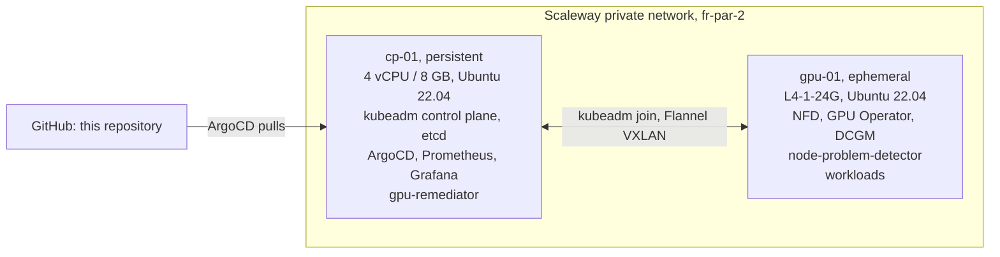

# Architecture

Two nodes, upstream Kubernetes via kubeadm, no vendor distribution.



## Why the nodes are split this way

The GPU node carries nothing stateful. Destroying it at the end of every session is
a real node lifecycle event, not a teardown, and it is the same drain-and-remove
operation the remediation controller performs when a GPU goes bad. By the time that
path is documented it has been rehearsed on every single session.

The control plane persists because Prometheus history has to survive between weekly
sessions. Session D measures goodput across an interrupted training run and records
a multi-hour burn-in, and neither is possible on a metrics store that resets.

## Node join

`scripts/gpu-up.sh` applies the GPU node with Terraform, waits for SSH, then asks the
control plane for a fresh join command and runs it on the new node:

```{ .sh .terminal }
$ ssh cp-01 'sudo kubeadm token create --print-join-command'
```

No bootstrap token is committed to Git and `--discovery-token-unsafe-skip-ca-verification`
is not used. The token is created on demand and expires.

## GitOps layout

ArgoCD runs an app-of-apps. Each component is an `Application` using two sources: the
upstream Helm chart, and this repository as a `ref` so that the values file lives in
Git next to everything else.

| Wave | Components |
|---|---|
| 0 | Node Feature Discovery |
| 1 | GPU Operator, kube-prometheus-stack |
| 2 | Grafana dashboards, Prometheus alert rules |
| 3 | node-problem-detector, gpu-remediator |
| 4 | Tenant namespaces and quotas |

Node Feature Discovery is deployed as its own `Application` with `nfd.enabled=false`
in the GPU Operator values. The GPU Operator can bring its own NFD, but owning it
separately means the labels that drive GPU scheduling are visible and pinned in Git
rather than a side effect of another chart.
