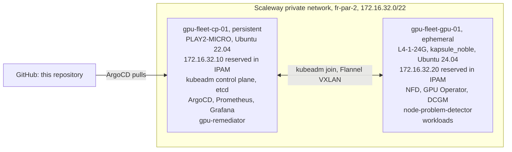

# Architecture

Two nodes, upstream Kubernetes via kubeadm, no vendor distribution.



## Why the nodes are split this way

The GPU node carries nothing stateful. Destroying it at the end of every session is
a real node lifecycle event, not a teardown, and it is the same drain-and-remove
operation the remediation controller performs when a GPU goes bad. By the time that
path is documented it has been rehearsed on every single session.

The control plane persists because Prometheus history has to survive between weekly
sessions. Session D measures goodput across an interrupted training run and records
a multi-hour burn-in, and neither is possible on a metrics store that resets.

## Addressing

Both private addresses are booked as IPAM reservations before either node is created.
This is not tidiness. The control plane has to know its own API server address before
it boots, because that address is the `kubeadm init` advertise address, a certificate
SAN, and the endpoint the GPU node joins through a week later. Booking it removes the
chicken and egg problem entirely: the address is a Terraform variable, not a discovery
step.

Each node still tries DHCP on its private NIC first and falls back to configuring the
reserved address statically only if DHCP has not delivered it. `node_ip_mode` flips the
whole cluster to public addressing in one variable if the Private Network proves
troublesome on the day.

## Node join

`scripts/gpu-up.sh` applies the GPU node with Terraform, waits for its bootstrap script
to finish, then asks the control plane for a fresh join command and runs it on the new
node:

```{ .sh .terminal }
$ ssh root@cp-01 'kubeadm token create --ttl 30m --print-join-command'
```

No bootstrap token is committed to Git and `--discovery-token-unsafe-skip-ca-verification`
is not used: the CA hash comes back in the same printed command. The token is created on
demand and expires in thirty minutes.

## GitOps layout

ArgoCD runs an app-of-apps. Each component is an `Application` using two sources: the
upstream Helm chart, and this repository as a `ref` so that the values file lives in
Git next to everything else.

| Wave | Components |
|---|---|
| -1 | local-path-provisioner |
| 0 | Node Feature Discovery, kube-prometheus-stack |
| 1 | GPU Operator |
| 2 | GPU alert rules and the Grafana dashboard |
| 3 | node-problem-detector, gpu-remediator |
| 4 | Tenant namespaces and quotas |

kube-prometheus-stack sits in wave 0, not wave 1 as first planned, because the GPU
Operator's ServiceMonitor for the DCGM exporter needs the Prometheus Operator's CRDs
to exist first. The waves only order readiness, rather than just creation, because
the ArgoCD values restore health checks for `Application` resources, which ArgoCD
dropped in 1.8. See [Findings](findings.md).

Node Feature Discovery is deployed as its own `Application` with `nfd.enabled=false`
in the GPU Operator values. The GPU Operator can bring its own NFD, but owning it
separately means the labels that drive GPU scheduling are visible and pinned in Git
rather than a side effect of another chart.
