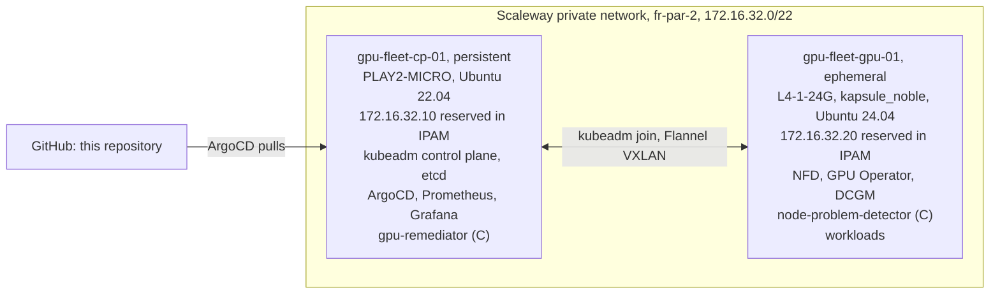

# Architecture

Two nodes running upstream Kubernetes through kubeadm, with no vendor distribution.
Items marked *(C)* arrive in Session C and don't exist yet.



## Why split the nodes this way

The GPU node holds nothing stateful, so I destroy it at the end of every session. That
teardown is a real node lifecycle event: the same cordon, drain and remove the
remediation controller will run when a GPU goes bad, so by the time I write that
controller, the path underneath it has run every session.

The control plane stays up because Prometheus history has to survive between weekly
sessions. Session D measures goodput across an interrupted training run and records a
multi-hour burn-in, and neither works with a metrics store that resets. In Session B,
193 GPU samples were still queryable after the GPU node was gone.

## Addressing

I reserve both private addresses in IPAM before either node exists. The control plane
needs its API server address before it boots: it's the `kubeadm init` advertise
address, a certificate SAN, and the endpoint the GPU node joins through a week later.
With a reservation, that address is a Terraform variable instead of something to
discover.

Each node still tries DHCP on its private NIC first, and only sets the reserved
address statically if DHCP hasn't delivered it. `node_ip_mode` switches the whole
cluster to public addressing with one variable, in case the Private Network gives
trouble on the day.

## Joining the GPU node

`scripts/gpu-up.sh` applies the GPU node with Terraform, waits for its bootstrap to
finish, asks the control plane for a fresh join command, and runs it on the new node:

```{ .sh .terminal }
$ ssh root@cp-01 'kubeadm token create --ttl 30m --print-join-command'
```

No bootstrap token is committed to Git, and I don't use
`--discovery-token-unsafe-skip-ca-verification`, since the CA hash comes back in the
same printed command. The token is created on demand and expires after 30 minutes.

## GitOps layout

ArgoCD runs an app of apps. Each component is an `Application` with two sources: the
upstream Helm chart, and this repository as a `ref`, so the values file sits in Git
with everything else.

| Wave | Components | Status |
|---|---|---|
| -1 | local-path-provisioner | Running |
| 0 | Node Feature Discovery, kube-prometheus-stack | Running |
| 1 | GPU Operator | Running |
| 2 | GPU alert rules and the Grafana dashboard | Running |
| 3 | node-problem-detector, gpu-remediator | Session C |
| 4 | Tenant namespaces and quotas | Session D |

kube-prometheus-stack is in wave 0 rather than wave 1 because the GPU Operator's
ServiceMonitor for the DCGM exporter needs the Prometheus Operator's CRDs first. Each
wave waits for the previous one to be healthy only because my ArgoCD values restore
the health check for `Application` resources that ArgoCD dropped in 1.8
([Findings](findings.md)).

Node Feature Discovery runs as its own `Application`, with `nfd.enabled=false` in the
GPU Operator values. The operator can bring its own NFD, but running it separately
keeps the labels that drive GPU scheduling visible and pinned in Git, not a side
effect of another chart.
