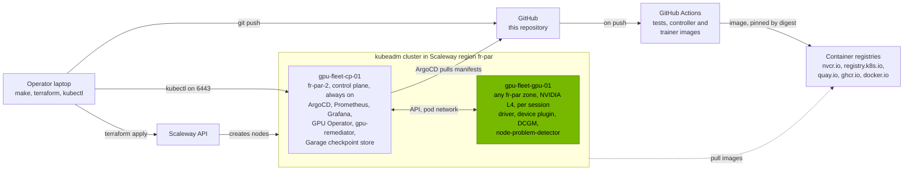
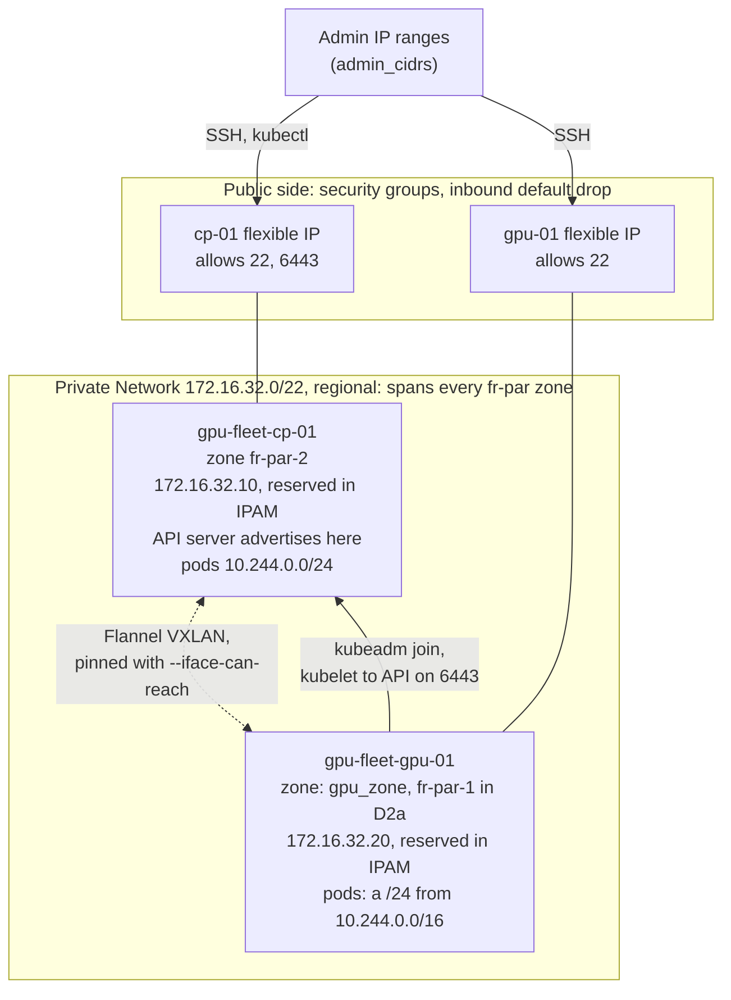
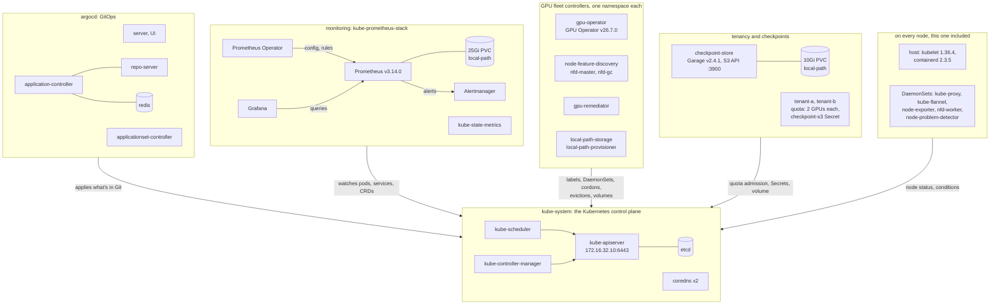
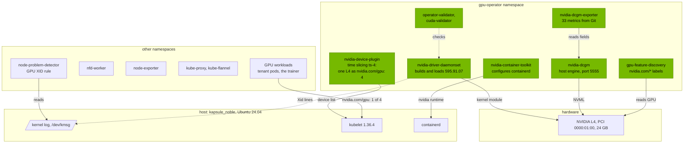
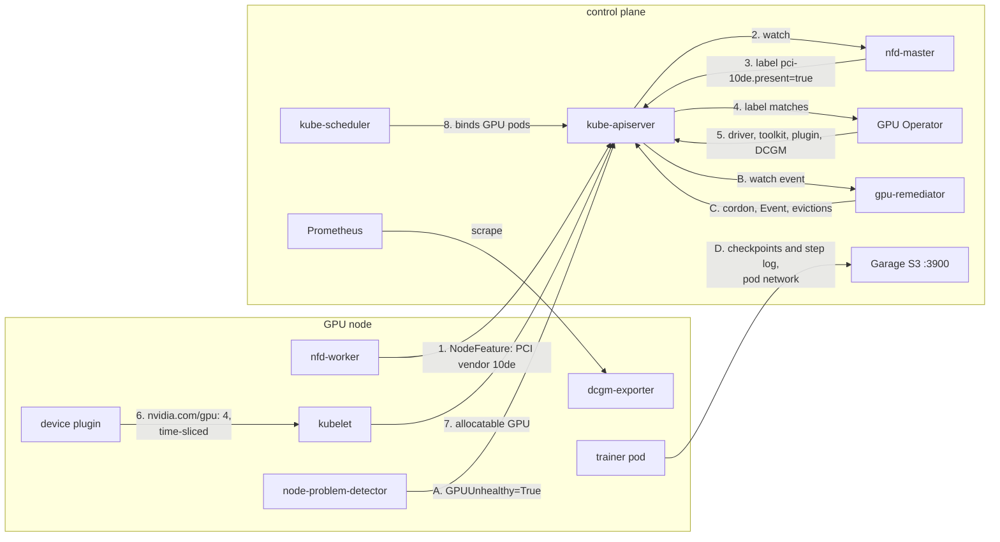
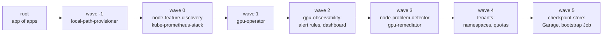

# Architecture

Two Scaleway instances running upstream Kubernetes through kubeadm, with no vendor
distribution. The control plane stays up; the GPU node exists only during a session.
Every diagram on this page shows what's deployed today, taken from the pod lists
captured in `docs/artifacts/`.

## The whole picture


```mermaid
flowchart LR
  laptop["Operator laptop<br/>make, terraform, kubectl"]
  scw["Scaleway API"]
  gh["GitHub<br/>this repository"]
  ci["GitHub Actions<br/>tests, controller and<br/>trainer images"]
  reg["Container registries<br/>nvcr.io, registry.k8s.io,<br/>quay.io, ghcr.io, docker.io"]

  subgraph cluster["kubeadm cluster in Scaleway region fr-par"]
    direction TB
    cp["gpu-fleet-cp-01<br/>fr-par-2, control plane, always on<br/>ArgoCD, Prometheus, Grafana,<br/>GPU Operator, gpu-remediator,<br/>Garage checkpoint store"]
    gpu["gpu-fleet-gpu-01<br/>any fr-par zone, NVIDIA L4, per session<br/>driver, device plugin, DCGM,<br/>node-problem-detector"]
    cp <-->|"API, pod network"| gpu
  end

  laptop -->|"terraform apply"| scw
  scw -->|"creates nodes"| cluster
  laptop -->|"kubectl on 6443"| cp
  laptop -->|"git push"| gh
  gh -->|"on push"| ci
  ci -->|"image, pinned by digest"| reg
  cp -->|"ArgoCD pulls manifests"| gh
  cluster -.->|"pull images"| reg

  classDef nv fill:#76b900,stroke:#4a7300,color:#000
  class gpu nv
```

A person does two things by hand: `terraform apply` through the `make` targets, and
`git push`. Everything that runs in the cluster, the GPU driver included, comes from
ArgoCD reading this repository.

## Network


```mermaid
flowchart TB
  admin["Admin IP ranges<br/>(admin_cidrs)"]

  subgraph pub["Public side: security groups, inbound default drop"]
    direction LR
    cpip["cp-01 flexible IP<br/>allows 22, 6443"]
    gpuip["gpu-01 flexible IP<br/>allows 22"]
  end

  subgraph pn["Private Network 172.16.32.0/22, regional: spans every fr-par zone"]
    direction LR
    cp["gpu-fleet-cp-01<br/>zone fr-par-2<br/>172.16.32.10, reserved in IPAM<br/>API server advertises here<br/>pods 10.244.0.0/24"]
    gpu["gpu-fleet-gpu-01<br/>zone: gpu_zone, fr-par-1 in D2a<br/>172.16.32.20, reserved in IPAM<br/>pods: a /24 from 10.244.0.0/16"]
    gpu -->|"kubeadm join,<br/>kubelet to API on 6443"| cp
    cp <-.->|"Flannel VXLAN,<br/>pinned with --iface-can-reach"| gpu
  end

  admin -->|"SSH, kubectl"| cpip
  admin -->|"SSH"| gpuip
  cpip --- cp
  gpuip --- gpu
```

Both private addresses exist in IPAM before either node boots. The control plane
needs its API server address up front: it's the `kubeadm init` advertise address, a
certificate SAN, and the endpoint the GPU node joins through a week later. Each node
tries DHCP on its private NIC first and only sets the reserved address statically if
DHCP hasn't delivered it (it always has, so far).

Flannel would pick the interface with the default route, which is the public one, so
the bootstrap pins it with `--iface-can-reach` to the control plane's private address.
`node_ip_mode` can move the whole cluster onto public addresses with one variable, in
case the Private Network ever misbehaves.

The Private Network belongs to the region, not a zone, and that paid off in Session D:
fr-par-2 had no L4 free, so `gpu_zone` put the GPU node in fr-par-1. Its IP, server,
private NIC and security group are the only zonal pieces that moved. It joined the
control plane across zones over the private network and ran the whole of D2a from
there, checkpoints to the control plane included.

## What runs on the control plane

Every pod on `gpu-fleet-cp-01`, grouped by namespace. The groups never call each
other; each one reads and writes objects through the API server at the bottom.
The kubelet and containerd run on the host, not as pods.


```mermaid
flowchart TB
  subgraph argo["argocd: GitOps"]
    direction LR
    as["server, UI"]
    actl["application-controller"] --- arepo["repo-server"]
    actl --- redis[("redis")]
    aset["applicationset-controller"]
  end

  subgraph mon["monitoring: kube-prometheus-stack"]
    direction LR
    pop["Prometheus Operator"] -->|"config, rules"| prom["Prometheus v3.14.0"]
    prom --- pvc[("25Gi PVC<br/>local-path")]
    prom -->|"alerts"| am["Alertmanager"]
    graf["Grafana"] -->|"queries"| prom
    ksm["kube-state-metrics"]
  end

  subgraph fleet["GPU fleet controllers, one namespace each"]
    direction LR
    gop["gpu-operator<br/>GPU Operator v26.7.0"]
    nfdm["node-feature-discovery<br/>nfd-master, nfd-gc"]
    gr["gpu-remediator"]
    lpp["local-path-storage<br/>local-path-provisioner"]
  end

  subgraph ten["tenancy and checkpoints"]
    direction LR
    garage["checkpoint-store<br/>Garage v2.4.1, S3 API :3900"] --- gpvc[("10Gi PVC<br/>local-path")]
    tns["tenant-a, tenant-b<br/>quota: 2 GPUs each,<br/>checkpoint-s3 Secret"]
  end

  subgraph every["on every node, this one included"]
    direction LR
    kubelet["host: kubelet 1.36.4,<br/>containerd 2.3.5"]
    ds["DaemonSets: kube-proxy, kube-flannel,<br/>node-exporter, nfd-worker,<br/>node-problem-detector"]
  end

  subgraph ks["kube-system: the Kubernetes control plane"]
    direction LR
    sch["kube-scheduler"] --> api["kube-apiserver<br/>172.16.32.10:6443"]
    kcm["kube-controller-manager"] --> api
    api --- etcd[("etcd")]
    dns["coredns x2"]
  end

  argo -->|"applies what's in Git"| ks
  mon -->|"watches pods, services, CRDs"| ks
  fleet -->|"labels, DaemonSets, cordons,<br/>evictions, volumes"| ks
  ten -->|"quota admission, Secrets, volume"| ks
  every -->|"node status, conditions"| ks
```

## What runs on the GPU node

The NVIDIA stack is built up in layers, each started by the GPU Operator once the one
below it validates.


```mermaid
flowchart TB
  subgraph hw["hardware"]
    l4["NVIDIA L4, PCI 0000:01:00, 24 GB"]
  end

  subgraph host["host: kapsule_noble, Ubuntu 24.04"]
    kmsg[/"kernel log, /dev/kmsg"/]
    kubelet["kubelet 1.36.4"]
    ctrd["containerd"]
  end

  subgraph gpuop["gpu-operator namespace"]
    drv["nvidia-driver-daemonset<br/>builds and loads 595.91.07"]
    tk["nvidia-container-toolkit<br/>configures containerd"]
    val["operator-validator,<br/>cuda-validator"]
    dp["nvidia-device-plugin<br/>time slicing ts-4:<br/>one L4 as nvidia.com/gpu: 4"]
    gfd["gpu-feature-discovery<br/>nvidia.com/* labels"]
    dcgm["nvidia-dcgm<br/>host engine, port 5555"]
    dcgme["nvidia-dcgm-exporter<br/>33 metrics from Git"]
  end

  subgraph other["other namespaces"]
    npd["node-problem-detector<br/>GPU XID rule"]
    nfdw["nfd-worker"]
    ne["node-exporter"]
    kp["kube-proxy, kube-flannel"]
    work["GPU workloads<br/>tenant pods, the trainer"]
  end

  drv -->|"kernel module"| l4
  tk -->|"nvidia runtime"| ctrd
  val -.->|"checks"| drv
  dp -->|"device list"| kubelet
  dcgm -->|"NVML"| l4
  dcgme -->|"reads fields"| dcgm
  gfd -->|"reads GPU"| l4
  npd -->|"reads"| kmsg
  drv -.->|"Xid lines"| kmsg
  work -->|"nvidia.com/gpu: 1 of 4"| kubelet

  classDef nv fill:#76b900,stroke:#4a7300,color:#000
  class drv,tk,val,dp,gfd,dcgm,dcgme nv
```

## How the two nodes work together

Apart from Prometheus scraping them, the GPU node's components never call a control
plane component directly. They go through the API server: one component writes an
object, and another is watching for it. Steps 1 to 8 are how a new GPU node becomes
schedulable, which Session A ran; A to C are the fault path from Session C, and D is
the training job's checkpoints from Session D.


```mermaid
flowchart LR
  subgraph gpu["GPU node"]
    nfdw["nfd-worker"]
    dp["device plugin"]
    kubelet["kubelet"]
    npd["node-problem-detector"]
    dcgme["dcgm-exporter"]
    trainer["trainer pod"]
  end

  subgraph cp["control plane"]
    api["kube-apiserver"]
    nfdm["nfd-master"]
    gop["GPU Operator"]
    sch["kube-scheduler"]
    gr["gpu-remediator"]
    prom["Prometheus"]
    garage["Garage S3 :3900"]
  end

  nfdw -->|"1. NodeFeature: PCI vendor 10de"| api
  api -->|"2. watch"| nfdm
  nfdm -->|"3. label pci-10de.present=true"| api
  api -->|"4. label matches"| gop
  gop -->|"5. driver, toolkit, plugin, DCGM"| api
  dp -->|"6. nvidia.com/gpu: 4,<br/>time-sliced"| kubelet
  kubelet -->|"7. allocatable GPU"| api
  sch -->|"8. binds GPU pods"| api
  npd -->|"A. GPUUnhealthy=True"| api
  api -->|"B. watch event"| gr
  gr -->|"C. cordon, Event, evictions"| api
  prom -->|"scrape"| dcgme
  trainer -->|"D. checkpoints and step log,<br/>pod network"| garage
```

## GitOps: what ArgoCD applies, and in what order


```mermaid
flowchart LR
  root["root<br/>app of apps"]
  w_1["wave -1<br/>local-path-provisioner"]
  w0["wave 0<br/>node-feature-discovery<br/>kube-prometheus-stack"]
  w1["wave 1<br/>gpu-operator"]
  w2["wave 2<br/>gpu-observability:<br/>alert rules, dashboard"]
  w3["wave 3<br/>node-problem-detector<br/>gpu-remediator"]
  w4["wave 4<br/>tenants:<br/>namespaces, quotas"]
  w5["wave 5<br/>checkpoint-store:<br/>Garage, bootstrap Job"]

  root --> w_1 --> w0 --> w1 --> w2 --> w3 --> w4 --> w5
```

Each Application has two sources: the upstream chart, untouched and pinned, and this
repository as a `ref` for the values file. A wave only starts once the previous one
is healthy, which works only because my ArgoCD values restore the health check for
`Application` resources that ArgoCD dropped in 1.8 ([Findings](findings.md)). Four
orderings matter:

- storage before anything that asks for a volume;
- kube-prometheus-stack before the GPU Operator, whose ServiceMonitor for the DCGM
  exporter needs the Prometheus Operator's CRDs;
- Node Feature Discovery before the GPU Operator, which selects nodes on NFD's labels.
- the tenant namespaces before the checkpoint store, whose bootstrap Job writes each
  tenant's S3 credentials into them.

I run NFD as its own Application, with `nfd.enabled=false` in the GPU Operator values,
so the labels that drive GPU scheduling are pinned in Git rather than a side effect
of another chart.

## Why split the nodes this way

The GPU node holds nothing stateful, so I destroy it at the end of every session. That
teardown is a real node lifecycle event, the same cordon, drain and remove the
remediation controller runs when a GPU goes bad. The control plane stays up because
Prometheus history has to survive between sessions: after Session B's GPU node was
gone, its 193 samples were still there.

## Joining the GPU node

`scripts/gpu-up.sh` applies the GPU node with Terraform, waits for its bootstrap, asks
the control plane for a fresh join command, and runs it on the new node:

```{ .sh .terminal }
$ ssh root@cp-01 'kubeadm token create --ttl 30m --print-join-command'
```

No bootstrap token is committed to Git, and I don't use
`--discovery-token-unsafe-skip-ca-verification`; the CA hash comes back in the same
printed command, and the token expires after 30 minutes.
