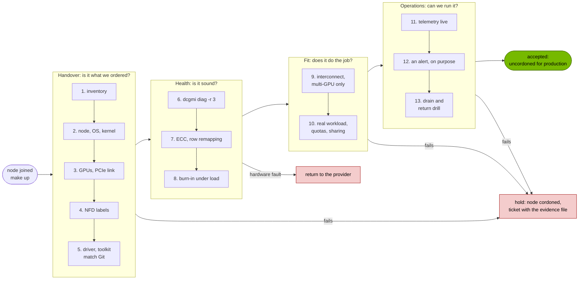

# Cluster acceptance runbook

!!! info "Status: written from Sessions A to D2a, two checks wait for D2b"
    Eleven of the thirteen checks below ran on this cluster, and each one links to
    the output it produced. Checks 6 and 8, `dcgmi diag -r 3` and the burn-in, run in
    D2b; their pass criteria are written down here first so the result can't shape
    them. Check 9 doesn't apply to one GPU, and check 1 doesn't apply to rented
    hardware. Both say what I'd do instead.

This takes a GPU node from "the provider says it's yours" to "it runs production
work". Work top to bottom. A failure high on the list makes everything below it
meaningless: there's no point burning in a GPU whose driver doesn't match the fleet,
or alerting on telemetry that never arrives.

Every command runs from the repository root on an operator's machine, with the
kubeconfig `make cluster` writes. Nobody logs into the GPU node; when a check needs
`nvidia-smi` or `dcgmi`, it runs inside the GPU Operator's own pods.



The split between "hold" and "return" matters. A version mismatch or a missing label
is ours to fix, and the node waits cordoned while we do. A GPU that fails its
diagnostic or carries uncorrectable memory errors is the provider's problem, and the
evidence file is what goes in the ticket.

## Exit criteria

The node is accepted when all of these hold.

| # | Criterion | Check | On this cluster |
|---|---|---|---|
| 1 | Every GPU the order says exists is present and enumerated | 3 | Ran, Session A |
| 2 | Driver and container toolkit versions match the ones pinned in Git | 5 | Ran, Session A |
| 3 | No uncorrectable ECC errors, no uncorrectable remapped rows, no remapping pending or failed | 7 | Partly: the counters ran in Session B, as screenshots. `make handover` captures them as text in D2b |
| 4 | Every GPU passes `dcgmi diag -r 3`, before and after the burn-in | 6 | D2b. Level 2 ran twice and passed in 6 s each time |
| 5 | 3 hours of sustained load with no thermal throttling, no new errors and no telemetry gaps | 8 | D2b |
| 6 | The scheduler admits and runs a real GPU workload, and enforces quotas | 10 | Ran, Sessions A and D |
| 7 | Telemetry reaches Prometheus for every GPU | 11 | Ran, Session B |
| 8 | An alert fires end to end, on purpose | 12 | Ran, Session B |
| 9 | A node can be drained and returned to service without improvising | 13 | Ran, Sessions C and D |

## The checks

### 1. Inventory reconciliation

Count the GPUs the order lists against the nodes and serial numbers the provider hands
over, before anything is installed. On a rack this is a walk with a scanner; a
mismatch found later costs a day of argument about whose fault it is.

**Here:** not applicable as such. The "hardware" is a Terraform apply of one
`L4-1-24G`, and the order is `terraform/terraform.tfvars`. What stands in for it is
recording the GPU's serial and UUID at check 3, so the evidence names the exact card.

### 2. Node reachable, OS and kernel at the standard

```{ .sh .terminal }
$ make handover
```

`make handover` is read-only and covers checks 2, 3, 4, 5, 7 and 11 in one go. It
writes `docs/artifacts/session-d-handover.txt` and a verdict file with one
`PASS`/`FAIL`/`CHECK` line per item.

**Expect:** the node `Ready`, kubelet `v1.36.4`, and the OS and kernel the image is
supposed to boot. In D2a the GPU node's bootstrap reported Ubuntu 24.04.4 LTS, kernel
`6.8.0-136-generic`, containerd 2.3.6 and kubelet `1.36.4-1.1`, printed by `make up`
from the facts file the bootstrap writes on the node.

**If not:** a node that never reaches `Ready` is usually networking. On this cluster
the first suspects are the private NIC (the bootstrap log on the node says whether DHCP
or the static fallback set the address) and Flannel picking the public interface. Hold
the node; don't continue.

### 3. GPU enumeration and PCIe link

**Expect:** `nvidia.com/gpu.count` equals the order, with the right product and memory
size, and `nvidia-smi` lists each GPU with its UUID, serial and PCI address. Session A:
one `NVIDIA-L4` with 23034 MiB on `00000000:01:00.0`
([`session-a-gpu-node.txt`](https://github.com/yassineteimi/nvidia-gpu-fleet-poc/blob/main/docs/artifacts/session-a-gpu-node.txt),
[`session-a-nvidia-smi.txt`](https://github.com/yassineteimi/nvidia-gpu-fleet-poc/blob/main/docs/artifacts/session-a-nvidia-smi.txt)).
`make handover` also records the PCIe link: maximum generation and width, and the
current values.

**If not:** a missing GPU is a hold and a ticket, with the `lspci` line from the
node's bootstrap log. Read the PCIe link carefully, though. An idle GPU drops its link
to save power, so a low *current* generation at rest means nothing; a *maximum* width
below what the card should have does mean something, usually a riser or a slot.

### 4. Node Feature Discovery labels

**Expect:** `feature.node.kubernetes.io/pci-10de.present=true`. The GPU Operator
selects nodes on that label, so without it nothing NVIDIA ever lands on the node.
Session A: present
([`session-a-nfd-labels.json`](https://github.com/yassineteimi/nvidia-gpu-fleet-poc/blob/main/docs/artifacts/session-a-nfd-labels.json)).

**If not:** check `nfd-worker` runs on the node and `nfd-master` is healthy. On this
cluster NFD is its own Application in wave 0, so `kubectl -n argocd get application
node-feature-discovery` is the first look.

### 5. Driver and container toolkit match Git

**Expect:** the node's `nvidia.com/cuda.driver-version.full` label equals the driver
version in `gitops/values/gpu-operator.yaml`, and the toolkit pod runs the pinned
toolkit tag. Session A: driver `595.91.07` on both sides, and the image had no NVIDIA
driver at first boot
([`session-a-acceptance.txt`](https://github.com/yassineteimi/nvidia-gpu-fleet-poc/blob/main/docs/artifacts/session-a-acceptance.txt),
[`session-a-gpu-image-inventory.txt`](https://github.com/yassineteimi/nvidia-gpu-fleet-poc/blob/main/docs/artifacts/session-a-gpu-image-inventory.txt)).

**If not:** the fleet's version lives in Git, so the fix is never on the node. Either
the operator is still rolling out (the `nvidia.com/gpu-driver-upgrade-state` label
says), or the image came with a driver of its own, which this cluster's bootstrap
refuses to continue past.

### 6. DCGM diagnostics, level 3

```{ .sh .terminal }
$ make burn-in-diag LABEL=before
```

It runs `dcgmi diag -r 3` inside the node's `nvidia-dcgm` pod and times it. Level 3
adds the stress plugins to level 2's software, memory and PCIe checks.

**Expect:** every plugin `Pass`, exit status 0. **Pass criterion, written before D2b:**
level 3 passes before the burn-in and again after it, on the same GPU.

**Here so far:** level 2 passed twice on the L4, in 6 seconds each time
([`session-c-dcgmi-diag.txt`](https://github.com/yassineteimi/nvidia-gpu-fleet-poc/blob/main/docs/artifacts/session-c-dcgmi-diag.txt),
[`session-d-dcgmi-diag.txt`](https://github.com/yassineteimi/nvidia-gpu-fleet-poc/blob/main/docs/artifacts/session-d-dcgmi-diag.txt)).
Level 3 runs in D2b.

**If not:** run it once more to rule out a busy GPU (the script refuses to start the
`after` run while the burn-in still holds the GPU). A second failure on the same
plugin is a hardware ticket with both outputs attached. Don't burn in a GPU that
failed level 3.

### 7. ECC and row remapping history

**Expect:** zero double-bit errors (`DCGM_FI_DEV_ECC_DBE_AGG_TOTAL`), zero
uncorrectable remapped rows, no remapping failure, and nothing pending in
`nvidia-smi -q -d ROW_REMAPPER`. Aggregate counters survive reboots, so they describe
the card's whole life, not today.

Correctable history is recorded, not failed on. Session B's dashboard showed this L4
arriving with one correctable remapped row and just under 100 aggregate single-bit
errors, with no uncorrectable rows and no failures: a healthy GPU that isn't new. I
read those off a screenshot, which is the reason `make handover` now captures them as
text.

**If not:** a pending remap clears with a GPU reset, after which the check runs again.
A remap failure, uncorrectable remapped rows or double-bit errors at handover go back
to the provider. Inside the fleet the same counters page someone:
`GPUECCDoubleBitError` and `GPURowRemapFailure` are critical alerts in
`gitops/manifests/observability/gpu-alerts.yaml`.

### 8. Burn-in under sustained load

```{ .sh .terminal }
$ make burn-in
$ make burn-in-capture
```

Three hours of `dcgmproftester` holding the tensor cores at their maximum, as a Job
with its own deadline. The capture reads Prometheus over exactly the Job's start to
completion, minus a minute at each end.

**Pass criteria, written before D2b:**

| Measure | Passes when |
|---|---|
| Thermal violation time over the window | 0 |
| Double-bit ECC, uncorrectable remapped rows, remap failures | No increase |
| XID count | No change |
| Minutes without a temperature sample | 0 |
| GPU Operator container restarts | 0 |
| Tensor activity | Held: minimum above zero for the whole window |
| `dcgmi diag -r 3` after the load | Passes, as at check 6 |

Power capping is recorded and not failed on. A 72 W L4 under a sustained tensor load
is power bound by design: in Session B it spent about 85% of 20 minutes power
throttled and none of it thermally
([Session B](02-observability.md)). On a card that isn't meant to sit at its power
limit, I'd add a power criterion here.

**If not:** a thermal violation on a cloud instance points at the host's cooling, and
that's a provider ticket. New uncorrectable errors or any XID during the burn-in mean
the GPU goes back, whatever the diagnostic says afterwards. A telemetry gap fails the
run rather than the GPU: the burn-in proved nothing for the minutes nobody watched, so
it runs again.

This is a scaled-down version of a real campaign, which runs for days across racks
and measures the whole system, not one card.

### 9. Multi-GPU interconnect

On nodes with several GPUs, measure NVLink and PCIe bandwidth between them, and NCCL
all-reduce bandwidth across nodes, against the topology's expected numbers.

**Here:** not applicable. One L4 has nothing to talk to, and that's the largest gap
between this cluster and a real acceptance. On a multi-GPU fleet this check is where
miscabled NVLink bridges and degraded network links turn up, and it gets as much time
as the burn-in.

### 10. A real workload, quotas and sharing

```{ .sh .terminal }
$ make acceptance
$ make tenancy && make tenancy-capture && make tenancy-stop
```

**Expect:** a CUDA pod completes with `Test PASSED`; with time slicing on, the node
advertises one `nvidia.com/gpu` per slice, pods from different tenants run side by
side, and a pod over its namespace's GPU quota is refused by the API server.

**Seen here:** `cuda-vectoradd` passed in Session A
([`session-a-cuda-vectoradd.txt`](https://github.com/yassineteimi/nvidia-gpu-fleet-poc/blob/main/docs/artifacts/session-a-cuda-vectoradd.txt)).
In Session D, one commit took the node to 4 slices in 88 seconds, three pods from two
tenants shared the L4, and the fourth got `exceeded quota: gpu`
([`session-d-tenancy.txt`](https://github.com/yassineteimi/nvidia-gpu-fleet-poc/blob/main/docs/artifacts/session-d-tenancy.txt)).

**If not:** a pod stuck `Pending` with `Insufficient nvidia.com/gpu` while the node
looks healthy usually means the device plugin isn't advertising: check its pod and the
`nvidia.com/gpu` line in the node's allocatable. A time slicing change that never
shows up is almost always a config edited under its old name; see
[Findings](findings.md#a-time-slicing-change-under-the-same-name-never-reaches-the-device-plugin).

### 11. Telemetry live

**Expect:** the DCGM exporter's target `up` in Prometheus, and every counter the alert
rules depend on present for every GPU. Session B: all 33 metrics in the custom set
present, plus the driver version, which the exporter attaches as a label rather than
exporting as a series
([`session-b-counters.txt`](https://github.com/yassineteimi/nvidia-gpu-fleet-poc/blob/main/docs/artifacts/session-b-counters.txt),
[`session-b-targets.txt`](https://github.com/yassineteimi/nvidia-gpu-fleet-poc/blob/main/docs/artifacts/session-b-targets.txt)).
`make capture-b` runs the full counter check; `make handover` checks the target.

**If not:** read the exporter's previous container log before anything else. On this
cluster it restarts a couple of times at every node start, until the standalone DCGM
host engine answers, and that's expected
([Findings](findings.md#the-exporter-restarts-at-startup-because-of-standalone-dcgm)).
A counter that's missing while the target is up is usually one the exporter ships
disabled and the values file never turned on.

### 12. An alert, on purpose

Make something alertable happen and follow it to Alertmanager. A rule that has never
fired is a rule nobody knows works.

**Seen here:** in Session B, killing a real tensor load fired `GPUUtilisationCollapse`
a minute after it went pending, and an XID 79 injected into DCGM's cache reached
Alertmanager as critical `GPUXidCritical` in 32 seconds
([`session-b-alert-timeline.txt`](https://github.com/yassineteimi/nvidia-gpu-fleet-poc/blob/main/docs/artifacts/session-b-alert-timeline.txt)).
The injected XID is simulated, and it says so in the evidence.

**If not:** check the rule evaluates at all (`make test-rules` runs every rule's unit
test offline), then Alertmanager's routes. A rule that fires in Prometheus but never
reaches Alertmanager is a routing problem, not a rule problem.

### 13. Drain and return-to-service drill

```{ .sh .terminal }
$ make workload
$ SESSION=d make inject-xid NODE=<node> XID=79
$ SESSION=d make return-to-service NODE=<node>
```

**Expect:** within seconds of the XID, the node is cordoned with an Event naming the
fault and every non-DaemonSet pod is evicted; the return to service refuses inside the
5 minute lookback, runs `dcgmi diag`, resets node-problem-detector and only then
uncordons.

**Seen here:** Session C cordoned the L4 node in 0.12 s and drained it in 2.5 s
([`session-c-xid79.txt`](https://github.com/yassineteimi/nvidia-gpu-fleet-poc/blob/main/docs/artifacts/session-c-xid79.txt)).
In Session D the same drill interrupted a training job, which resumed from its
checkpoint once the node came back
([Session D](04-goodput-and-burn-in.md)).

**If not:** if nothing cordons, check the node's `GPUUnhealthy` condition first: no
condition means node-problem-detector didn't match the line, a condition with no cordon
means the controller refused, and its Events say why (it won't touch a node that isn't
a GPU node). Never uncordon by hand to finish the drill; the gates are the point.

## XID decode table

The codes an operator meets most, with the driver's own name for each, from
`src/common/sdk/nvidia/inc/nverror.h` in the open GPU kernel modules at `595.91.07`.
The application or fault split is the NVIDIA device plugin's, from
`internal/rm/health.go` at `v0.20.0`; this cluster's alert rules and
node-problem-detector rule draw the same line
([Findings](findings.md#the-device-plugin-already-decides-which-xids-mean-a-broken-gpu)).
The last column is my operating policy, not NVIDIA's.

| XID | Driver name | Class | What I do |
|---|---|---|---|
| 13 | `ROBUST_CHANNEL_GR_EXCEPTION` | Application | Event only. Look at the job; repeated 13s across many jobs on one GPU earn a diagnostic |
| 31 | `ROBUST_CHANNEL_FIFO_ERROR_MMU_ERR_FLT` | Application | Event only. Usually a bad memory access in the job |
| 43 | `ROBUST_CHANNEL_RESETCHANNEL_VERIF_ERROR` | Application | Event only |
| 45 | `ROBUST_CHANNEL_PREEMPTIVE_REMOVAL` | Application | Event only. It follows another error; decode that one |
| 68 | `ROBUST_CHANNEL_NVDEC0_ERROR` | Application | Event only |
| 109 | Not in `nverror.h`; the device plugin calls it a context switch timeout | Application | Event only |
| 48 | `ROBUST_CHANNEL_GPU_ECC_DBE` | Fault | Cordon and drain. Return to service only after a reset and a passing diagnostic; a second one goes back to the provider |
| 63 | `INFOROM_PAGE_RETIREMENT_EVENT` | Fault | Cordon and drain, reset to apply the remap, check 7 again |
| 64 | `INFOROM_PAGE_RETIREMENT_FAILURE` | Fault | Cordon and drain. The memory can't be repaired in place: back to the provider |
| 74 | `NVLINK_ERROR` | Fault | Cordon and drain, then check 9 on the node |
| 79 | `ROBUST_CHANNEL_GPU_HAS_FALLEN_OFF_THE_BUS` | Fault | Cordon and drain. Needs a node reboot at least; a repeat is hardware |
| 92 | `EXCESSIVE_SBE_INTERRUPTS` | Fault | Cordon and drain, then check 7 |
| 94 | `ROBUST_CHANNEL_CONTAINED_ERROR` | Fault | Cordon and drain. The error was contained to one context, so a reset and a diagnostic usually suffice |
| 95 | `ROBUST_CHANNEL_UNCONTAINED_ERROR` | Fault | Cordon and drain, reset, diagnostic. Treat a repeat as hardware |
| 119 | `GSP_RPC_TIMEOUT` | Fault | Cordon and drain, reboot the node. Note the driver version in the ticket |
| 120 | `GSP_ERROR` | Fault | As 119 |

Session C tested two rows of this table on the L4: XID 13 produced an Event and nothing
else, and XID 79 cordoned and drained the node. Both were injected, so they test this
cluster's handling, not the GPU's behaviour.
