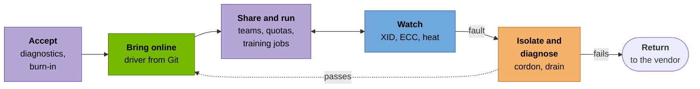

# The use cases

Training a large model means thousands of GPUs working on one job in lockstep. When
one of them fails, the whole job stops until it's replaced. Meta's
[Llama 3 paper](https://arxiv.org/abs/2407.21783) is unusually frank about how often
that happens: 419 unexpected interruptions in 54 days of training on 16,384 H100s,
roughly one every three hours, and most of them traced to hardware.

So the GPUs themselves are only half of what a GPU cloud sells. The other half is
the operations around them: getting new servers into service the same way every time,
noticing a GPU going bad before a customer's job does, taking it out of rotation
without a human in the loop, and knowing how much of a customer's paid time actually
went into training. Cloud providers, NVIDIA's Cloud Partners and every company running
its own AI cluster do this work every day, usually called "day 2 operations".

This project rebuilds that work on a small scale: one rented NVIDIA L4 on a Kubernetes
cluster I built myself, run the way a fleet operator would run it.

## A GPU's life in a fleet

Each step below is a use case, and the colour shows the session that built it.

Green: Session A. Blue: Session B. Orange: Session C.
Purple: Session D.

## The six use cases

-   **Bring GPUs online the same way every time**

    ---

    A provider adds racks every week, and a node with the wrong driver version fails
    jobs in ways that are hard to trace. Here, a commit pins the NVIDIA driver and
    the GPU Operator installs it on a node that boots with none.

    [Session A](01-platform.md): driver `595.91.07`, from Git, on a driverless image.

-   **See a failing GPU before the customer does**

    ---

    A GPU reports trouble long before it dies: XID error codes, memory errors,
    throttling. Someone has to be paged on the right signals and not on noise.

    [Session B](02-observability.md): a simulated GPU fault reached the on-call
    alert in 32 seconds.

-   **Take a broken GPU out of service on its own**

    ---

    At fleet scale nobody can drain a node by hand at 3 a.m. A controller does it,
    and the node only comes back after a diagnostic passes.

    [Session C](03-fault-remediation.md): cordoned in 0.12 s, drained in 2.5 s.

-   **Share one GPU between teams, fairly**

    ---

    Notebooks and small inference jobs don't need a whole GPU. Slicing it, with a
    quota per team, keeps an expensive card busy without one team taking all of it.

    [Session D](04-goodput-and-burn-in.md): one commit, one L4 shown as four.

-   **Know how much of a training run was useful**

    ---

    "Goodput" is the share of a job's time spent on work that ends up in the trained
    model. Every failure eats into it, and you can't improve what you don't measure.

    [Session D](04-goodput-and-burn-in.md): 66.4% through an injected GPU fault, and
    where the other 33.6% went.

-   **Accept new hardware before it takes real work**

    ---

    New GPUs fail most often early in their life. A burn-in finds the weak ones while
    a failure still costs nothing, and the vendor gets the evidence.

    [Session D](04-goodput-and-burn-in.md) and the [runbook](runbook.md): 3 hours at
    full load, no errors.

## What's real and what isn't

Everything ran on real hardware, and every number on these pages links to output
captured during a session. Two things are scaled down: one GPU stands in for a
fleet, and three hours of burn-in stand in for days. The GPU faults were injected,
because I can't make a rented GPU fail on demand; the [simulated](simulated.md) page
lists exactly what was simulated and what wasn't.
